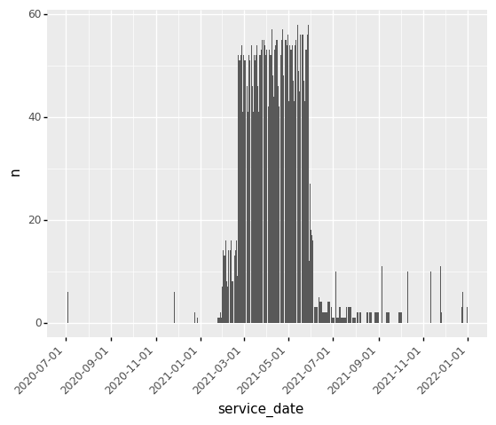
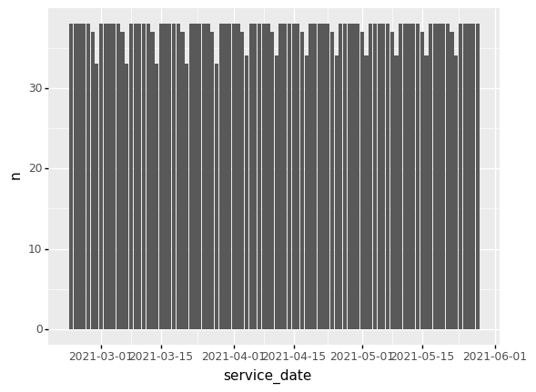

* what is a service?
  - gtfs definition
  - defines when a trip is active (e.g. "service schedule" is a better word?)
  - calendar dates: "some set of trips apply to this day"
* how many schedules active in a specific day?
* how many routes have trips scheduled in a specific day?
* how many trips scheduled in a specific day?
* how many stops scheduled?
  - stops vs stop times?

<details>

<summary>show code</summary>


```python
%run 0_data_model.ipynb

pk_str = ["calitp_itp_id", "calitp_url_number"]
pk_col = (_.calitp_itp_id, _.calitp_url_number)
```


</details>

<details>

<summary>show code</summary>


```python
tbl_schedule_daily
```


</details>


<div><pre># Source: lazy query
# DB Conn: Engine(bigquery://cal-itp-data-infra/?maximum_bytes_billed=100000000)
# Preview:
</pre><div>
<style scoped>
    .dataframe tbody tr th:only-of-type {
        vertical-align: middle;
    }

    .dataframe tbody tr th {
        vertical-align: top;
    }

    .dataframe thead th {
        text-align: right;
    }
</style>
<table border="1" class="dataframe">
  <thead>
    <tr style="text-align: right;">
      <th></th>
      <th>calitp_itp_id</th>
      <th>calitp_url_number</th>
      <th>service_id</th>
      <th>service_cal_start_date</th>
      <th>service_cal_end_date</th>
      <th>calitp_extracted_at</th>
      <th>service_indicator</th>
      <th>service_date</th>
      <th>service_inclusion</th>
      <th>service_exclusion</th>
      <th>is_in_service</th>
    </tr>
  </thead>
  <tbody>
    <tr>
      <th>0</th>
      <td>34</td>
      <td>0</td>
      <td>c_139_b_398_d_31</td>
      <td>2013-01-01</td>
      <td>2024-01-01</td>
      <td>2021-04-19</td>
      <td>0</td>
      <td>2014-09-13</td>
      <td>None</td>
      <td>None</td>
      <td>False</td>
    </tr>
    <tr>
      <th>1</th>
      <td>97</td>
      <td>0</td>
      <td>c_1856_b_1167_d_32</td>
      <td>2016-01-01</td>
      <td>2020-01-01</td>
      <td>2021-04-16</td>
      <td>0</td>
      <td>2016-06-28</td>
      <td>None</td>
      <td>None</td>
      <td>False</td>
    </tr>
    <tr>
      <th>2</th>
      <td>97</td>
      <td>0</td>
      <td>c_1856_b_1167_d_32</td>
      <td>2016-01-01</td>
      <td>2020-01-01</td>
      <td>2021-04-16</td>
      <td>0</td>
      <td>2016-07-01</td>
      <td>None</td>
      <td>None</td>
      <td>False</td>
    </tr>
    <tr>
      <th>3</th>
      <td>99</td>
      <td>0</td>
      <td>c_237_b_78_d_4</td>
      <td>2015-01-02</td>
      <td>2021-12-31</td>
      <td>2021-05-03</td>
      <td>0</td>
      <td>2016-08-06</td>
      <td>None</td>
      <td>None</td>
      <td>False</td>
    </tr>
    <tr>
      <th>4</th>
      <td>1</td>
      <td>5</td>
      <td>c_237_b_78_d_4</td>
      <td>2015-01-02</td>
      <td>2021-12-31</td>
      <td>2021-05-03</td>
      <td>0</td>
      <td>2016-10-30</td>
      <td>None</td>
      <td>None</td>
      <td>False</td>
    </tr>
  </tbody>
</table>
</div><p># .. may have more rows</p></div>


<details>

<summary>show code</summary>


```python
from plotnine import *
import datetime

DATE_START = str(datetime.date.today() - datetime.timedelta(weeks = 2))
DATE_END = str(datetime.date.today())
```


</details>

# Daily schedules

## Total counts and date ranges

<details>

<summary>show code</summary>


```python
(
    tbl_schedule_daily
    >> filter(_.is_in_service)
    >> summarize(
        ttl_schedule_days=n(_),
        ttl_unique_service_ids = _.service_id.nunique(),
        min_date=_.service_date.min(),
        max_date=_.service_date.max(),
        ttl_inclusions=_.service_inclusion.count(),
        ttl_exclusions=_.service_exclusion.count(),
    )
    >> collect()
)
```


</details>


<div>
<style scoped>
    .dataframe tbody tr th:only-of-type {
        vertical-align: middle;
    }

    .dataframe tbody tr th {
        vertical-align: top;
    }

    .dataframe thead th {
        text-align: right;
    }
</style>
<table border="1" class="dataframe">
  <thead>
    <tr style="text-align: right;">
      <th></th>
      <th>ttl_schedule_days</th>
      <th>ttl_unique_service_ids</th>
      <th>min_date</th>
      <th>max_date</th>
      <th>ttl_inclusions</th>
      <th>ttl_exclusions</th>
    </tr>
  </thead>
  <tbody>
    <tr>
      <th>0</th>
      <td>469094</td>
      <td>1038</td>
      <td>2010-12-31</td>
      <td>2050-01-01</td>
      <td>6090</td>
      <td>0</td>
    </tr>
  </tbody>
</table>
</div>


<details>

<summary>show code</summary>


```python
(
    tbl_schedule_daily
    >> count(year=_.service_date.dt.year, is_in_service=_.is_in_service)
    >> collect()
    >> ggplot(aes("year", "n", fill="is_in_service")) + geom_col()
)
```


</details>


    

    


    <ggplot: (301341935)>


## How many daily schedules are active for the past week?

<details>

<summary>show code</summary>


```python
(
    tbl_schedule_daily
    >> filter(_.is_in_service, _.service_date.between(DATE_START, DATE_END))
    >> summarize(
        ttl_schedule_days=n(_),
        ttl_unique_service_ids=_.service_id.nunique(),
        min_date=_.service_date.min(),
        max_date=_.service_date.max(),
        ttl_inclusions=_.service_inclusion.count(),
        ttl_exclusions=_.service_exclusion.count(),
    )
    >> collect()
)
```


</details>


<div>
<style scoped>
    .dataframe tbody tr th:only-of-type {
        vertical-align: middle;
    }

    .dataframe tbody tr th {
        vertical-align: top;
    }

    .dataframe thead th {
        text-align: right;
    }
</style>
<table border="1" class="dataframe">
  <thead>
    <tr style="text-align: right;">
      <th></th>
      <th>ttl_schedule_days</th>
      <th>ttl_unique_service_ids</th>
      <th>min_date</th>
      <th>max_date</th>
      <th>ttl_inclusions</th>
      <th>ttl_exclusions</th>
    </tr>
  </thead>
  <tbody>
    <tr>
      <th>0</th>
      <td>7019</td>
      <td>815</td>
      <td>2021-04-30</td>
      <td>2021-05-14</td>
      <td>789</td>
      <td>0</td>
    </tr>
  </tbody>
</table>
</div>


## How does calendar_dates affect daily schedules?

<details>

<summary>show code</summary>


```python
(
    tbl_schedule_daily
    >> count(
        _.service_indicator, _.service_inclusion, _.service_exclusion, _.is_in_service
    )
    >> collect()
    >> arrange(_.service_indicator, _.service_inclusion, _.service_exclusion)
)
```


</details>


<div>
<style scoped>
    .dataframe tbody tr th:only-of-type {
        vertical-align: middle;
    }

    .dataframe tbody tr th {
        vertical-align: top;
    }

    .dataframe thead th {
        text-align: right;
    }
</style>
<table border="1" class="dataframe">
  <thead>
    <tr style="text-align: right;">
      <th></th>
      <th>service_indicator</th>
      <th>service_inclusion</th>
      <th>service_exclusion</th>
      <th>is_in_service</th>
      <th>n</th>
    </tr>
  </thead>
  <tbody>
    <tr>
      <th>5</th>
      <td>0</td>
      <td>True</td>
      <td>None</td>
      <td>True</td>
      <td>452</td>
    </tr>
    <tr>
      <th>6</th>
      <td>0</td>
      <td>None</td>
      <td>True</td>
      <td>False</td>
      <td>107</td>
    </tr>
    <tr>
      <th>0</th>
      <td>0</td>
      <td>None</td>
      <td>None</td>
      <td>False</td>
      <td>585847</td>
    </tr>
    <tr>
      <th>7</th>
      <td>1</td>
      <td>True</td>
      <td>None</td>
      <td>True</td>
      <td>3</td>
    </tr>
    <tr>
      <th>3</th>
      <td>1</td>
      <td>None</td>
      <td>True</td>
      <td>False</td>
      <td>2350</td>
    </tr>
    <tr>
      <th>1</th>
      <td>1</td>
      <td>None</td>
      <td>None</td>
      <td>True</td>
      <td>463004</td>
    </tr>
    <tr>
      <th>2</th>
      <td>None</td>
      <td>True</td>
      <td>None</td>
      <td>True</td>
      <td>5635</td>
    </tr>
    <tr>
      <th>4</th>
      <td>None</td>
      <td>None</td>
      <td>True</td>
      <td>False</td>
      <td>456</td>
    </tr>
  </tbody>
</table>
</div>


<details>

<summary>show code</summary>


```python
(
    tbl_schedule_daily
    >> summarize(
        ttl_inclusion=_.service_inclusion.count(),
        ttl_exclusion=_.service_exclusion.count(),
    )
)
```


</details>


<div><pre># Source: lazy query
# DB Conn: Engine(bigquery://cal-itp-data-infra/?maximum_bytes_billed=100000000)
# Preview:
</pre><div>
<style scoped>
    .dataframe tbody tr th:only-of-type {
        vertical-align: middle;
    }

    .dataframe tbody tr th {
        vertical-align: top;
    }

    .dataframe thead th {
        text-align: right;
    }
</style>
<table border="1" class="dataframe">
  <thead>
    <tr style="text-align: right;">
      <th></th>
      <th>ttl_inclusion</th>
      <th>ttl_exclusion</th>
    </tr>
  </thead>
  <tbody>
    <tr>
      <th>0</th>
      <td>6090</td>
      <td>2913</td>
    </tr>
  </tbody>
</table>
</div><p># .. may have more rows</p></div>


## Which schedules use only `calendar_dates.txt`?

<details>

<summary>show code</summary>


```python
tbl_schedule_daily >> filter(_.service_indicator.isna()) >> head(1)
```


</details>


<div><pre># Source: lazy query
# DB Conn: Engine(bigquery://cal-itp-data-infra/?maximum_bytes_billed=100000000)
# Preview:
</pre><div>
<style scoped>
    .dataframe tbody tr th:only-of-type {
        vertical-align: middle;
    }

    .dataframe tbody tr th {
        vertical-align: top;
    }

    .dataframe thead th {
        text-align: right;
    }
</style>
<table border="1" class="dataframe">
  <thead>
    <tr style="text-align: right;">
      <th></th>
      <th>calitp_itp_id</th>
      <th>calitp_url_number</th>
      <th>service_id</th>
      <th>service_cal_start_date</th>
      <th>service_cal_end_date</th>
      <th>calitp_extracted_at</th>
      <th>service_indicator</th>
      <th>service_date</th>
      <th>service_inclusion</th>
      <th>service_exclusion</th>
      <th>is_in_service</th>
    </tr>
  </thead>
  <tbody>
    <tr>
      <th>0</th>
      <td>1</td>
      <td>4</td>
      <td>FEB21-Weekday-72-FEB21-1111100-</td>
      <td>None</td>
      <td>None</td>
      <td>None</td>
      <td>None</td>
      <td>2021-04-05</td>
      <td>True</td>
      <td>None</td>
      <td>True</td>
    </tr>
  </tbody>
</table>
</div><p># .. may have more rows</p></div>


<details>

<summary>show code</summary>


```python
exception_schedules = (
    tbl_schedule_daily
    >> group_by(_.calitp_itp_id, _.calitp_url_number, _.service_id)
    >> filter(_.service_indicator.isna().all())
    >> ungroup()
)

exception_counts = (
    exception_schedules
    >> count(_.calitp_itp_id, _.calitp_url_number, _.service_id)
    >> arrange(-_.n)
)

df_exception_counts = exception_counts >> collect()
df_exception_counts
```


</details>


<div>
<style scoped>
    .dataframe tbody tr th:only-of-type {
        vertical-align: middle;
    }

    .dataframe tbody tr th {
        vertical-align: top;
    }

    .dataframe thead th {
        text-align: right;
    }
</style>
<table border="1" class="dataframe">
  <thead>
    <tr style="text-align: right;">
      <th></th>
      <th>calitp_itp_id</th>
      <th>calitp_url_number</th>
      <th>service_id</th>
      <th>n</th>
    </tr>
  </thead>
  <tbody>
    <tr>
      <th>0</th>
      <td>278</td>
      <td>0</td>
      <td>73346-1111111-0</td>
      <td>126</td>
    </tr>
    <tr>
      <th>1</th>
      <td>278</td>
      <td>0</td>
      <td>72987-1111100-0</td>
      <td>90</td>
    </tr>
    <tr>
      <th>2</th>
      <td>278</td>
      <td>0</td>
      <td>72957-1111100-0</td>
      <td>88</td>
    </tr>
    <tr>
      <th>3</th>
      <td>278</td>
      <td>0</td>
      <td>72954-1111100-0</td>
      <td>88</td>
    </tr>
    <tr>
      <th>4</th>
      <td>278</td>
      <td>0</td>
      <td>72968-1111100-0</td>
      <td>88</td>
    </tr>
    <tr>
      <th>...</th>
      <td>...</td>
      <td>...</td>
      <td>...</td>
      <td>...</td>
    </tr>
    <tr>
      <th>218</th>
      <td>278</td>
      <td>0</td>
      <td>72979-1111100-0</td>
      <td>1</td>
    </tr>
    <tr>
      <th>219</th>
      <td>343</td>
      <td>0</td>
      <td>c_21375_b_29794_d_32</td>
      <td>1</td>
    </tr>
    <tr>
      <th>220</th>
      <td>182</td>
      <td>0</td>
      <td>DSE-US-1650</td>
      <td>1</td>
    </tr>
    <tr>
      <th>221</th>
      <td>62</td>
      <td>0</td>
      <td>c_17552_b_26542_d_32</td>
      <td>1</td>
    </tr>
    <tr>
      <th>222</th>
      <td>30</td>
      <td>0</td>
      <td>c_21294_b_29772_d_127</td>
      <td>1</td>
    </tr>
  </tbody>
</table>
<p>223 rows × 4 columns</p>
</div>


### Do they occur on specific days?

It looks like there are more weekday entries, but seem fairly evenly spread out.

<details>

<summary>show code</summary>


```python
exception_dates = (
    exception_schedules
    >> left_join(_, tbl.views_dim_date(), {"service_date": "full_date"})    
    >> mutate(is_weekend = _.day_name.isin(["Saturday", "Sunday"]))
)

(exception_dates
        >> count(_.day_name) >> collect()
#     >> collect()
#     >> ggplot(aes("service_date", "n")) + geom_col()
)
```


</details>


<div>
<style scoped>
    .dataframe tbody tr th:only-of-type {
        vertical-align: middle;
    }

    .dataframe tbody tr th {
        vertical-align: top;
    }

    .dataframe thead th {
        text-align: right;
    }
</style>
<table border="1" class="dataframe">
  <thead>
    <tr style="text-align: right;">
      <th></th>
      <th>day_name</th>
      <th>n</th>
    </tr>
  </thead>
  <tbody>
    <tr>
      <th>0</th>
      <td>Friday</td>
      <td>933</td>
    </tr>
    <tr>
      <th>1</th>
      <td>Monday</td>
      <td>898</td>
    </tr>
    <tr>
      <th>2</th>
      <td>Thursday</td>
      <td>863</td>
    </tr>
    <tr>
      <th>3</th>
      <td>Tuesday</td>
      <td>830</td>
    </tr>
    <tr>
      <th>4</th>
      <td>Wednesday</td>
      <td>821</td>
    </tr>
    <tr>
      <th>5</th>
      <td>Saturday</td>
      <td>698</td>
    </tr>
    <tr>
      <th>6</th>
      <td>Sunday</td>
      <td>626</td>
    </tr>
  </tbody>
</table>
</div>


### Do they occur on specific dates?

<details>

<summary>show code</summary>


```python
join_keys = ["calitp_itp_id", "calitp_url_number", "service_id"]
join_cols = [_[k] for k in join_keys]

(
    exception_dates
    >> filter(_.service_date.between("2020-01-01", "2021-12-31"))
    >> count(_.service_date)
    >> collect()
    >> mutate(service_date = _.service_date.astype("datetime64[ns]"))
    >> ggplot(aes("service_date", "n")) + geom_col() + theme(axis_text_x = element_text(angle = 45, hjust = 1))
)
```


</details>


    

    


    <ggplot: (318255880)>


### Use 1: regular service

<details>

<summary>show code</summary>


```python
(
    exception_schedules
    >> distinct(_.calitp_itp_id, _.calitp_url_number, _.service_id)
    >> count(_.calitp_itp_id, _.calitp_url_number)
    >> head()
)
```


</details>


<div><pre># Source: lazy query
# DB Conn: Engine(bigquery://cal-itp-data-infra/?maximum_bytes_billed=100000000)
# Preview:
</pre><div>
<style scoped>
    .dataframe tbody tr th:only-of-type {
        vertical-align: middle;
    }

    .dataframe tbody tr th {
        vertical-align: top;
    }

    .dataframe thead th {
        text-align: right;
    }
</style>
<table border="1" class="dataframe">
  <thead>
    <tr style="text-align: right;">
      <th></th>
      <th>calitp_itp_id</th>
      <th>calitp_url_number</th>
      <th>n</th>
    </tr>
  </thead>
  <tbody>
    <tr>
      <th>0</th>
      <td>8</td>
      <td>1</td>
      <td>109</td>
    </tr>
    <tr>
      <th>1</th>
      <td>278</td>
      <td>0</td>
      <td>36</td>
    </tr>
    <tr>
      <th>2</th>
      <td>182</td>
      <td>0</td>
      <td>16</td>
    </tr>
    <tr>
      <th>3</th>
      <td>310</td>
      <td>1</td>
      <td>8</td>
    </tr>
    <tr>
      <th>4</th>
      <td>343</td>
      <td>0</td>
      <td>6</td>
    </tr>
  </tbody>
</table>
</div><p># .. may have more rows</p></div>


<details>

<summary>show code</summary>


```python
(
    exception_schedules
    >> filter(_.calitp_itp_id == 8, _.calitp_url_number == 1)
    >> filter(_.service_date.dt.year.isin([2020, 2021]))
    >> collect()
    >> count(_.service_date)
    >> mutate(service_date = _.service_date.astype("datetime64[ns]"))
    >> ggplot(aes("service_date", "n")) + geom_col()
)
```


</details>


    

    


    <ggplot: (318292947)>


Note that they also have a `calendar.txt`, with 4 entries:

<details>

<summary>show code</summary>


```python
tbl.gtfs_schedule_calendar() >> filter_itp8 >> count() >> collect()
```


</details>


<div>
<style scoped>
    .dataframe tbody tr th:only-of-type {
        vertical-align: middle;
    }

    .dataframe tbody tr th {
        vertical-align: top;
    }

    .dataframe thead th {
        text-align: right;
    }
</style>
<table border="1" class="dataframe">
  <thead>
    <tr style="text-align: right;">
      <th></th>
      <th>n</th>
    </tr>
  </thead>
  <tbody>
    <tr>
      <th>0</th>
      <td>4</td>
    </tr>
  </tbody>
</table>
</div>


However, it does not have any corresponding trips. In this case, it looks like they rely purely on their `calendar_dates.txt` file!

<details>

<summary>show code</summary>


```python
(
    tbl.gtfs_schedule_calendar()
    >> filter_itp8
    >> inner_join(_, trip_routes, [*pk_str, "service_id"])
)
```


</details>


<div><pre># Source: lazy query
# DB Conn: Engine(bigquery://cal-itp-data-infra/?maximum_bytes_billed=100000000)
# Preview:
</pre><div>
<style scoped>
    .dataframe tbody tr th:only-of-type {
        vertical-align: middle;
    }

    .dataframe tbody tr th {
        vertical-align: top;
    }

    .dataframe thead th {
        text-align: right;
    }
</style>
<table border="1" class="dataframe">
  <thead>
    <tr style="text-align: right;">
      <th></th>
      <th>calitp_itp_id</th>
      <th>calitp_url_number</th>
      <th>service_id</th>
      <th>monday</th>
      <th>tuesday</th>
      <th>wednesday</th>
      <th>thursday</th>
      <th>friday</th>
      <th>saturday</th>
      <th>sunday</th>
      <th>start_date</th>
      <th>end_date</th>
      <th>calitp_extracted_at</th>
      <th>trip_id</th>
      <th>route_id</th>
      <th>route_long_name</th>
      <th>route_url</th>
      <th>route_type</th>
    </tr>
  </thead>
  <tbody>
  </tbody>
</table>
</div><p># .. may have more rows</p></div>


### Use 2: rare schedules

<details>

<summary>show code</summary>


```python
(
    tbl.gtfs_schedule_trips()
    >> filter(
        _.calitp_itp_id == 177,
        _.calitp_url_number == 0,
        _.service_id == "c_17149_b_none_d_0",
    )
    >> left_join(
        _,
        tbl.gtfs_schedule_routes(),
        ["calitp_itp_id", "calitp_url_number", "route_id"],
    )
    >> select(_.route_long_name, _.route_url, _.route_type)
    >> head(1)
)
```


</details>


<div><pre># Source: lazy query
# DB Conn: Engine(bigquery://cal-itp-data-infra/?maximum_bytes_billed=100000000)
# Preview:
</pre><div>
<style scoped>
    .dataframe tbody tr th:only-of-type {
        vertical-align: middle;
    }

    .dataframe tbody tr th {
        vertical-align: top;
    }

    .dataframe thead th {
        text-align: right;
    }
</style>
<table border="1" class="dataframe">
  <thead>
    <tr style="text-align: right;">
      <th></th>
      <th>route_long_name</th>
      <th>route_url</th>
      <th>route_type</th>
    </tr>
  </thead>
  <tbody>
    <tr>
      <th>0</th>
      <td>The Link - Baldwin Hills Parklands</td>
      <td>https://dpw.lacounty.gov/transit/TheLinkBaldwi...</td>
      <td>3</td>
    </tr>
  </tbody>
</table>
</div><p># .. may have more rows</p></div>


