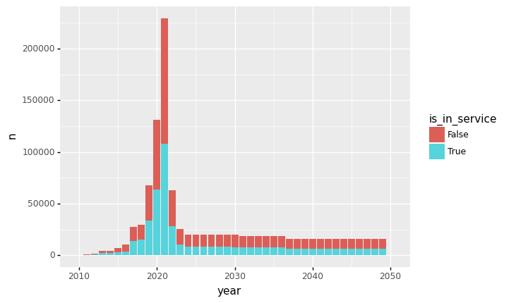

* what is a service?
  - gtfs definition
  - defines when a trip is active (e.g. "service schedule" is a better word?)
  - calendar dates: "some set of trips apply to this day"
* how many schedules active in a specific day?
* how many routes have trips scheduled in a specific day?
* how many trips scheduled in a specific day?
* how many stops scheduled?
  - stops vs stop times?


```python
%run 0_data_model.ipynb
```


```python
pk_str = ["calitp_itp_id", "calitp_url_number"]
pk_col = (_.calitp_itp_id, _.calitp_url_number)

```


```python
tbl_schedule_daily
```


<div><pre># Source: lazy query
# DB Conn: Engine(bigquery://cal-itp-data-infra/?maximum_bytes_billed=100000000)
# Preview:
</pre><table border="0" class="dataframe">
  <thead>
    <tr style="text-align: right;">
      <th></th>
      <th>calitp_itp_id</th>
      <th>calitp_url_number</th>
      <th>service_id</th>
      <th>service_cal_start_date</th>
      <th>service_cal_end_date</th>
      <th>calitp_extracted_at</th>
      <th>service_indicator</th>
      <th>service_date</th>
      <th>service_inclusion</th>
      <th>service_exclusion</th>
      <th>is_in_service</th>
    </tr>
  </thead>
  <tbody>
    <tr>
      <th>0</th>
      <td>256</td>
      <td>0</td>
      <td>Sunday</td>
      <td>2010-12-31</td>
      <td>2020-12-31</td>
      <td>2021-04-16</td>
      <td>0</td>
      <td>2019-06-17</td>
      <td>None</td>
      <td>None</td>
      <td>False</td>
    </tr>
    <tr>
      <th>1</th>
      <td>256</td>
      <td>0</td>
      <td>Sunday</td>
      <td>2010-12-31</td>
      <td>2020-12-31</td>
      <td>2021-04-16</td>
      <td>0</td>
      <td>2014-08-25</td>
      <td>None</td>
      <td>None</td>
      <td>False</td>
    </tr>
    <tr>
      <th>2</th>
      <td>256</td>
      <td>0</td>
      <td>Sunday</td>
      <td>2010-12-31</td>
      <td>2020-12-31</td>
      <td>2021-04-16</td>
      <td>0</td>
      <td>2011-12-05</td>
      <td>None</td>
      <td>None</td>
      <td>False</td>
    </tr>
    <tr>
      <th>3</th>
      <td>256</td>
      <td>0</td>
      <td>Saturday</td>
      <td>2010-12-31</td>
      <td>2020-12-31</td>
      <td>2021-04-16</td>
      <td>0</td>
      <td>2012-06-18</td>
      <td>None</td>
      <td>None</td>
      <td>False</td>
    </tr>
    <tr>
      <th>4</th>
      <td>256</td>
      <td>0</td>
      <td>Saturday</td>
      <td>2010-12-31</td>
      <td>2020-12-31</td>
      <td>2021-04-16</td>
      <td>0</td>
      <td>2013-02-11</td>
      <td>None</td>
      <td>None</td>
      <td>False</td>
    </tr>
  </tbody>
</table>
<p>5 rows × 11 columns</p><p># .. may have more rows</p></div>


```python
from plotnine import *
import datetime

DATE_START = str(datetime.date.today() - datetime.timedelta(weeks = 2))
DATE_END = str(datetime.date.today())
```

# Daily schedules

## Total counts and date ranges


```python
(
    tbl_schedule_daily
    >> filter(_.is_in_service)
    >> summarize(
        ttl_schedule_days=n(_),
        ttl_unique_service_ids = _.service_id.nunique(),
        min_date=_.service_date.min(),
        max_date=_.service_date.max(),
        ttl_inclusions=_.service_inclusion.count(),
        ttl_exclusions=_.service_exclusion.count(),
    )
    >> collect()
)
```


<table border="0" class="dataframe">
  <thead>
    <tr style="text-align: right;">
      <th></th>
      <th>ttl_schedule_days</th>
      <th>ttl_unique_service_ids</th>
      <th>min_date</th>
      <th>max_date</th>
      <th>ttl_inclusions</th>
      <th>ttl_exclusions</th>
    </tr>
  </thead>
  <tbody>
    <tr>
      <th>0</th>
      <td>469094</td>
      <td>1038</td>
      <td>2010-12-31</td>
      <td>2050-01-01</td>
      <td>6090</td>
      <td>0</td>
    </tr>
  </tbody>
</table>
<p>1 rows × 6 columns</p>


```python
(
    tbl_schedule_daily
    >> count(year=_.service_date.dt.year, is_in_service=_.is_in_service)
    >> collect()
    >> ggplot(aes("year", "n", fill="is_in_service")) + geom_col()
)
```


    

    


    <ggplot: (311992766)>


## How many daily schedules are active for the past week?


```python
(
    tbl_schedule_daily
    >> filter(_.is_in_service, _.service_date.between(DATE_START, DATE_END))
    >> summarize(
        ttl_schedule_days=n(_),
        ttl_unique_service_ids=_.service_id.nunique(),
        min_date=_.service_date.min(),
        max_date=_.service_date.max(),
        ttl_inclusions=_.service_inclusion.count(),
        ttl_exclusions=_.service_exclusion.count(),
    )
    >> collect()
)
```


<table border="0" class="dataframe">
  <thead>
    <tr style="text-align: right;">
      <th></th>
      <th>ttl_schedule_days</th>
      <th>ttl_unique_service_ids</th>
      <th>min_date</th>
      <th>max_date</th>
      <th>ttl_inclusions</th>
      <th>ttl_exclusions</th>
    </tr>
  </thead>
  <tbody>
    <tr>
      <th>0</th>
      <td>7059</td>
      <td>830</td>
      <td>2021-05-03</td>
      <td>2021-05-17</td>
      <td>794</td>
      <td>0</td>
    </tr>
  </tbody>
</table>
<p>1 rows × 6 columns</p>


## How does calendar_dates affect daily schedules?


```python
(
    tbl_schedule_daily
    >> count(
        _.service_indicator, _.service_inclusion, _.service_exclusion, _.is_in_service
    )
    >> collect()
    >> arrange(_.service_indicator, _.service_inclusion, _.service_exclusion)
)
```


<table border="0" class="dataframe">
  <thead>
    <tr style="text-align: right;">
      <th></th>
      <th>service_indicator</th>
      <th>service_inclusion</th>
      <th>service_exclusion</th>
      <th>is_in_service</th>
      <th>n</th>
    </tr>
  </thead>
  <tbody>
    <tr>
      <th>5</th>
      <td>0</td>
      <td>True</td>
      <td>None</td>
      <td>True</td>
      <td>452</td>
    </tr>
    <tr>
      <th>6</th>
      <td>0</td>
      <td>None</td>
      <td>True</td>
      <td>False</td>
      <td>107</td>
    </tr>
    <tr>
      <th>0</th>
      <td>0</td>
      <td>None</td>
      <td>None</td>
      <td>False</td>
      <td>585847</td>
    </tr>
    <tr>
      <th>7</th>
      <td>1</td>
      <td>True</td>
      <td>None</td>
      <td>True</td>
      <td>3</td>
    </tr>
    <tr>
      <th>3</th>
      <td>1</td>
      <td>None</td>
      <td>True</td>
      <td>False</td>
      <td>2350</td>
    </tr>
    <tr>
      <th>1</th>
      <td>1</td>
      <td>None</td>
      <td>None</td>
      <td>True</td>
      <td>463004</td>
    </tr>
    <tr>
      <th>2</th>
      <td>None</td>
      <td>True</td>
      <td>None</td>
      <td>True</td>
      <td>5635</td>
    </tr>
    <tr>
      <th>4</th>
      <td>None</td>
      <td>None</td>
      <td>True</td>
      <td>False</td>
      <td>456</td>
    </tr>
  </tbody>
</table>
<p>8 rows × 5 columns</p>


```python
(
    tbl_schedule_daily
    >> summarize(
        ttl_inclusion=_.service_inclusion.count(),
        ttl_exclusion=_.service_exclusion.count(),
    )
)
```


<div><pre># Source: lazy query
# DB Conn: Engine(bigquery://cal-itp-data-infra/?maximum_bytes_billed=100000000)
# Preview:
</pre><table border="0" class="dataframe">
  <thead>
    <tr style="text-align: right;">
      <th></th>
      <th>ttl_inclusion</th>
      <th>ttl_exclusion</th>
    </tr>
  </thead>
  <tbody>
    <tr>
      <th>0</th>
      <td>6090</td>
      <td>2913</td>
    </tr>
  </tbody>
</table>
<p>1 rows × 2 columns</p><p># .. may have more rows</p></div>


## Which schedules use only `calendar_dates.txt`?


```python
tbl_schedule_daily >> filter(_.service_indicator.isna()) >> head(1)
```


```python
exception_schedules = (
    tbl_schedule_daily
    >> group_by(_.calitp_itp_id, _.calitp_url_number, _.service_id)
    >> filter(_.service_indicator.isna().all())
    >> ungroup()
)

exception_counts = (
    exception_schedules
    >> count(_.calitp_itp_id, _.calitp_url_number, _.service_id)
    >> arrange(-_.n)
)

df_exception_counts = exception_counts >> collect()
df_exception_counts
```

### Do they occur on specific days?

It looks like there are more weekday entries, but seem fairly evenly spread out.


```python
exception_dates = (
    exception_schedules
    >> left_join(_, tbl.views_dim_date(), {"service_date": "full_date"})    
    >> mutate(is_weekend = _.day_name.isin(["Saturday", "Sunday"]))
)

(exception_dates
        >> count(_.day_name) >> collect()
#     >> collect()
#     >> ggplot(aes("service_date", "n")) + geom_col()
)
```

### Do they occur on specific dates?


```python
join_keys = ["calitp_itp_id", "calitp_url_number", "service_id"]
join_cols = [_[k] for k in join_keys]

(
    exception_dates
    >> filter(_.service_date.between("2020-01-01", "2021-12-31"))
    >> count(_.service_date)
    >> collect()
    >> mutate(service_date = _.service_date.astype("datetime64[ns]"))
    >> ggplot(aes("service_date", "n")) + geom_col() + theme(axis_text_x = element_text(angle = 45, hjust = 1))
)
```

### Use 1: regular service


```python
(
    exception_schedules
    >> distinct(_.calitp_itp_id, _.calitp_url_number, _.service_id)
    >> count(_.calitp_itp_id, _.calitp_url_number)
    >> head()
)
```


```python
filter_itp8 = filter(_.calitp_itp_id == 8, _.calitp_url_number == 1)

(
    exception_schedules
    >> filter_itp8
    >> filter(_.service_date.dt.year.isin([2020, 2021]))
    >> collect()
    >> count(_.service_date)
    >> mutate(service_date = _.service_date.astype("datetime64[ns]"))
    >> ggplot(aes("service_date", "n")) + geom_col()
)
```

Note that they also have a `calendar.txt`, with 4 entries:


```python
tbl.gtfs_schedule_calendar() >> filter_itp8 >> count() >> collect()
```

However, it does not have any corresponding trips. In this case, it looks like they rely purely on their `calendar_dates.txt` file!


```python
(
    tbl.gtfs_schedule_calendar()
    >> filter_itp8
    >> inner_join(_, tbl.gtfs_schedule_trips(), [*pk_str, "service_id"])
    >> count()
)
```

### Use 2: rare schedules


```python
(
    tbl.gtfs_schedule_trips()
    >> filter(
        _.calitp_itp_id == 177,
        _.calitp_url_number == 0,
        _.service_id == "c_17149_b_none_d_0",
    )
    >> left_join(
        _,
        tbl.gtfs_schedule_routes(),
        ["calitp_itp_id", "calitp_url_number", "route_id"],
    )
    >> select(_.route_long_name, _.route_url, _.route_type)
    >> head(1)
)
```
