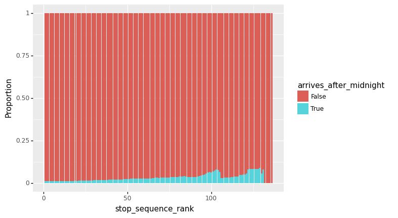
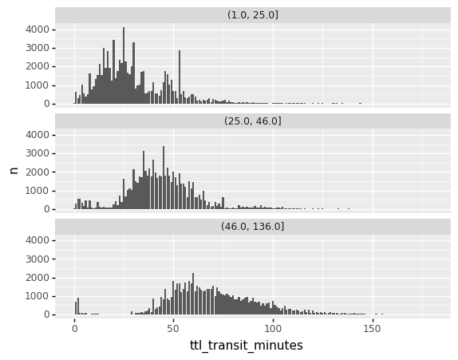
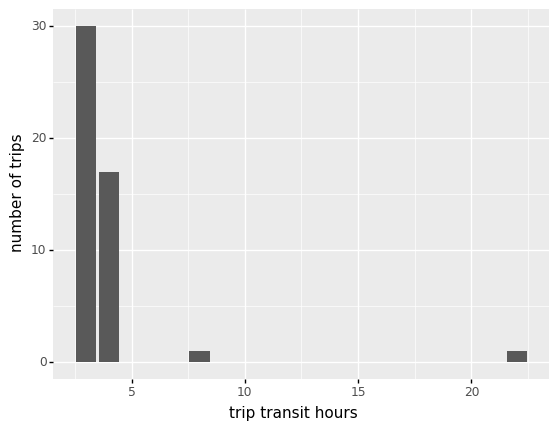

<details>

<summary>show code</summary>


```python
%run 0_data_model.ipynb
```


</details>

<details>

<summary>show code</summary>


```python
pk_str = ["calitp_itp_id", "calitp_url_number"]
pk_col = (_.calitp_itp_id, _.calitp_url_number)

DATE_START = "2021-04-01"
DATE_END = "2021-05-01"
```


</details>

<details>

<summary>show code</summary>


```python
# Convenience tables
agency_trip_routes = (
    tbl.gtfs_schedule_trips()
    >> select(*pk_col, _.trip_id, _.route_id)
    >> inner_join(
        _,
        tbl.gtfs_schedule_routes() >> select(*pk_col, _.route_id, _.route_long_name),
        [*pk_str, "route_id"],
    )
)

# trip_stop_times = (
#     tbl_stops_and_times
#     >> inner_join(
#         _,
#         tbl.gtfs_schedule_trips() >> select(_.trip_id, _.service_id, _.route_id, *pk_col),
#         [*pk_str, "trip_id"],
#     )
# )

trip_stop_times = tbl_stops_and_times
```


</details>

* 30:01:01 is not a time in most data systems
* we may want to know which times occur after midnight

## Motivating Cases

## Modelling time in transit, midnight switchpoint

### Maximum hour part in stop_times data

<details>

<summary>show code</summary>


```python
extract_hour = lambda colname: sql_raw('REGEXP_EXTRACT(%s, "([0-9]*?):")' % colname)

hour_extracted = trip_stop_times >> mutate(
    arrival_hour=extract_hour("arrival_time"),
    departure_hour=extract_hour("departure_time"),
)

(
    hour_extracted
    >> summarize(
        max_hour=_.arrival_hour.astype(int).max(),
        departure_hour=_.departure_hour.astype(int).max(),
    )
    >> collect()
)
```


</details>


<table border="0" class="dataframe">
  <thead>
    <tr style="text-align: right;">
      <th></th>
      <th>max_hour</th>
      <th>departure_hour</th>
    </tr>
  </thead>
  <tbody>
    <tr>
      <th>0</th>
      <td>30</td>
      <td>30</td>
    </tr>
  </tbody>
</table>
<p>1 rows × 2 columns</p>


### Converting to a TIME type

<details>

<summary>show code</summary>


```python
from siuba.siu import symbolic_dispatch
from siuba.sql.dialects.bigquery import BigqueryColumn
from sqlalchemy import sql

@symbolic_dispatch(cls=BigqueryColumn)
def str_format(col, fmt) -> BigqueryColumn:
    return sql.func.format(fmt, col)

@symbolic_dispatch(cls=BigqueryColumn)
def as_time(col, fmt=None) -> BigqueryColumn:
    return sql.func.parse_time(fmt or "%T", col)

@symbolic_dispatch(cls=BigqueryColumn)
def time_diff(x, y, unit) -> BigqueryColumn:
    return sql.func.time_diff(x, y, sql.text(unit))


fix_hour = str_format(_.arrival_hour.astype(int) % 24, "%02d")

df_hour_counts = (hour_extracted >> 
  count(_.arrival_hour, new_arrival_hour = fix_hour)
  >> collect()
  >> arrange(_.arrival_hour)
)

with pd.option_context("display.max_rows", 999):
    display(df_hour_counts >> filter(_.arrival_hour != _.new_arrival_hour))
```


</details>


<table border="0" class="dataframe">
  <thead>
    <tr style="text-align: right;">
      <th></th>
      <th>arrival_hour</th>
      <th>new_arrival_hour</th>
      <th>n</th>
    </tr>
  </thead>
  <tbody>
    <tr>
      <th>41</th>
      <td>0</td>
      <td>00</td>
      <td>277</td>
    </tr>
    <tr>
      <th>40</th>
      <td>1</td>
      <td>01</td>
      <td>318</td>
    </tr>
    <tr>
      <th>39</th>
      <td>2</td>
      <td>02</td>
      <td>318</td>
    </tr>
    <tr>
      <th>20</th>
      <td>24</td>
      <td>00</td>
      <td>60521</td>
    </tr>
    <tr>
      <th>22</th>
      <td>25</td>
      <td>01</td>
      <td>35024</td>
    </tr>
    <tr>
      <th>26</th>
      <td>26</td>
      <td>02</td>
      <td>24413</td>
    </tr>
    <tr>
      <th>27</th>
      <td>27</td>
      <td>03</td>
      <td>19963</td>
    </tr>
    <tr>
      <th>29</th>
      <td>28</td>
      <td>04</td>
      <td>14184</td>
    </tr>
    <tr>
      <th>32</th>
      <td>29</td>
      <td>05</td>
      <td>5267</td>
    </tr>
    <tr>
      <th>38</th>
      <td>3</td>
      <td>03</td>
      <td>487</td>
    </tr>
    <tr>
      <th>37</th>
      <td>30</td>
      <td>06</td>
      <td>498</td>
    </tr>
    <tr>
      <th>35</th>
      <td>4</td>
      <td>04</td>
      <td>2001</td>
    </tr>
    <tr>
      <th>30</th>
      <td>5</td>
      <td>05</td>
      <td>6795</td>
    </tr>
    <tr>
      <th>28</th>
      <td>6</td>
      <td>06</td>
      <td>18920</td>
    </tr>
    <tr>
      <th>25</th>
      <td>7</td>
      <td>07</td>
      <td>30335</td>
    </tr>
    <tr>
      <th>24</th>
      <td>8</td>
      <td>08</td>
      <td>33791</td>
    </tr>
    <tr>
      <th>21</th>
      <td>9</td>
      <td>09</td>
      <td>35070</td>
    </tr>
    <tr>
      <th>0</th>
      <td>None</td>
      <td>None</td>
      <td>693065</td>
    </tr>
  </tbody>
</table>
<p>18 rows × 3 columns</p>


### Augmenting to indicate when stop times are after midnight

* is_midnight_point
* arrives_after_midnight

<details>

<summary>show code</summary>


```python
from siuba.dply.vector import lag

# Create new time columns to track hour number, as well as converting
# times like 25:00:00 to 1:00:00
stop_times_fixed = (
    hour_extracted
    >> mutate(
        stop_sequence = _.stop_sequence.astype(int),
        arrival_hour_24=(_.arrival_hour.astype(int) % 24).astype(str),
        departure_hour_24=(_.departure_hour.astype(int) % 24).astype(str),
        new_arrival_time=as_time(_.arrival_time.str.replace("^([0-9]*?):", _.arrival_hour_24 + ":")),
        new_departure_time=as_time(_.departure_time.str.replace("^([0-9]*?):", _.departure_hour_24 + ":"))
    )
)

# this expression infers when an arrival time is after midnight, by checking one of these holds..
# * explicitly encoded
#   - departure hour coded as >= 24 (e.g. 24:00:00)
#   - or, arrival hour coded as > 24
# * implicitly coded
#   - previous departure is later than 22:00 (assuming transit times are < 2 hours)
#   - and, it's an earlier time than previous departure (e.g. departed 23:50, arrived 00:10)
# * it's after a stop time that met the above criteria
expr_after_midnight = (
    (_.departure_hour.astype(int) >= 24)
    | (_.arrival_hour.astype(int) > 24)
    | ((_.prev_departure > "22:00:00") & (_.new_arrival_time < _.prev_departure))
).fillna(False).astype(int).cumsum() >= 1


stop_times_enhanced = (
    stop_times_fixed
    >> group_by(*pk_col, _.trip_id)
    >> arrange(_.stop_sequence)
    >> mutate(
        prev_departure=lag(_.new_departure_time),
        arrives_after_midnight=expr_after_midnight,
        # if arrival is after midnight, need to add a days worth of seconds
        # to the time diff, to account for e.g. 00:00 - 23:50 being negative
        n_transit_seconds_raw=(
            time_diff(_.new_arrival_time, _.prev_departure, "SECOND")
        ),
        n_transit_seconds=if_else(_.n_transit_seconds_raw < 0, _.n_transit_seconds_raw + (60 * 60 * 24), _.n_transit_seconds_raw),
        ttl_transit_seconds=_.n_transit_seconds.cumsum(),
    )
    >> ungroup()
)
```


</details>

<details>

<summary>show code</summary>


```python
stop_times_enhanced >> count(_.arrives_after_midnight)
```


</details>


<div><pre># Source: lazy query
# DB Conn: Engine(bigquery://cal-itp-data-infra/?maximum_bytes_billed=1000000000)
# Preview:
</pre><table border="0" class="dataframe">
  <thead>
    <tr style="text-align: right;">
      <th></th>
      <th>arrives_after_midnight</th>
      <th>n</th>
    </tr>
  </thead>
  <tbody>
    <tr>
      <th>0</th>
      <td>False</td>
      <td>9417497</td>
    </tr>
    <tr>
      <th>1</th>
      <td>True</td>
      <td>161528</td>
    </tr>
  </tbody>
</table>
<p>2 rows × 2 columns</p><p># .. may have more rows</p></div>


<details>

<summary>show code</summary>


```python
from plotnine import *

(
    stop_times_enhanced
    >> count(_.arrives_after_midnight, _.stop_sequence_rank)
    >> collect()
    >> group_by(_.stop_sequence_rank)
    >> mutate(prop = _.n / _.n.sum())
    >> ungroup()
    >> ggplot(aes("stop_sequence_rank", "prop", fill="arrives_after_midnight"))
#    + facet_wrap("~arrives_after_midnight")
    + geom_col()
    + labs(y = "Proportion")
)
```


</details>


    

    


    <ggplot: (-9223372036530360204)>


## Edge cases: trips beginning at or after midnight

Trips can begin after midnight. As far as I can tell, what this means is that a trip reported as being in service on, e.g., a Monday is actually scheduled for Tuesday morning. I have no idea why this happens, but would imagine it's because either:

* some agencies schedule by route (i.e. batches of trips).
* some agencies prefer in cases to present it like this to users (e.g. a Monday route service with a 2am trip matches a "waking day").

Below is a count of trips starting at or after midnight:

<details>

<summary>show code</summary>


```python
midnight_edge_cases = (
    stop_times_enhanced
    >> filter(_.arrival_hour.astype(int) >= 24, _.departure_hour.astype(int) >= 24)
    >> select(
        _.calitp_itp_id,
        _.calitp_url_number,
        _.trip_id,
        _.stop_id,
        _.stop_sequence_rank,
        _.contains("time"),
        _.prev_departure,
        _.arrives_after_midnight,
        _.arrival_hour
    )
)

(
    midnight_edge_cases
    >> filter(_.stop_sequence_rank == 1)
    >> count()
    >> collect()
)
```


</details>


<table border="0" class="dataframe">
  <thead>
    <tr style="text-align: right;">
      <th></th>
      <th>n</th>
    </tr>
  </thead>
  <tbody>
    <tr>
      <th>0</th>
      <td>2746</td>
    </tr>
  </tbody>
</table>
<p>1 rows × 1 columns</p>


### Case 1: trips that left exactly at midnight

One maybe ambiguous case is when a trip leaves at midnight. This is shown for one specific trip below.

<details>

<summary>show code</summary>


```python
(
    midnight_edge_cases
    >> filter(_.calitp_itp_id == 4, _.calitp_url_number == 0, _.trip_id == "6855070")
    >> collect()
    >> head()
    >> arrange(_.stop_sequence_rank)
)
```


</details>


<table border="0" class="dataframe">
  <thead>
    <tr style="text-align: right;">
      <th></th>
      <th>calitp_itp_id</th>
      <th>calitp_url_number</th>
      <th>trip_id</th>
      <th>stop_id</th>
      <th>stop_sequence_rank</th>
      <th>arrival_time</th>
      <th>departure_time</th>
      <th>timepoint</th>
      <th>stop_timezone</th>
      <th>new_arrival_time</th>
      <th>new_departure_time</th>
      <th>prev_departure</th>
      <th>arrives_after_midnight</th>
      <th>arrival_hour</th>
    </tr>
  </thead>
  <tbody>
    <tr>
      <th>0</th>
      <td>4</td>
      <td>0</td>
      <td>6855070</td>
      <td>5654</td>
      <td>1</td>
      <td>24:00:00</td>
      <td>24:00:00</td>
      <td>1</td>
      <td>None</td>
      <td>00:00:00</td>
      <td>00:00:00</td>
      <td>None</td>
      <td>True</td>
      <td>24</td>
    </tr>
    <tr>
      <th>1</th>
      <td>4</td>
      <td>0</td>
      <td>6855070</td>
      <td>254</td>
      <td>2</td>
      <td>24:00:06</td>
      <td>24:00:06</td>
      <td>0</td>
      <td>None</td>
      <td>00:00:06</td>
      <td>00:00:06</td>
      <td>00:00:00</td>
      <td>True</td>
      <td>24</td>
    </tr>
    <tr>
      <th>2</th>
      <td>4</td>
      <td>0</td>
      <td>6855070</td>
      <td>233</td>
      <td>3</td>
      <td>24:00:52</td>
      <td>24:00:52</td>
      <td>0</td>
      <td>None</td>
      <td>00:00:52</td>
      <td>00:00:52</td>
      <td>00:00:06</td>
      <td>True</td>
      <td>24</td>
    </tr>
    <tr>
      <th>3</th>
      <td>4</td>
      <td>0</td>
      <td>6855070</td>
      <td>229</td>
      <td>4</td>
      <td>24:01:00</td>
      <td>24:01:00</td>
      <td>1</td>
      <td>None</td>
      <td>00:01:00</td>
      <td>00:01:00</td>
      <td>00:00:52</td>
      <td>True</td>
      <td>24</td>
    </tr>
    <tr>
      <th>4</th>
      <td>4</td>
      <td>0</td>
      <td>6855070</td>
      <td>236</td>
      <td>5</td>
      <td>24:01:29</td>
      <td>24:01:29</td>
      <td>0</td>
      <td>None</td>
      <td>00:01:29</td>
      <td>00:01:29</td>
      <td>00:01:00</td>
      <td>True</td>
      <td>24</td>
    </tr>
  </tbody>
</table>
<p>5 rows × 14 columns</p>


Note that in the table above, the trip leaves exactly at midnight (shown by a departure time of `24:00:00` in the first row).

### Case 2: trips leaving hours after midnight

While it could be argued for the case above that the current day should include `24:00:00`, other trips are coded as starting after 24:00:00 (e.g. 25:00:00). These cases are problematic, since they're being described under the service schedule for the wrong day.

It could be interpreted as follows:

* The Mission route will be in service Monday, with a trip leaving at 2am Tuesday.

<details>

<summary>show code</summary>


```python
(
    midnight_edge_cases
    >> filter(_.stop_sequence_rank == 1, _.arrival_hour.astype(int) >= 25)
    >> inner_join(_, agency_trip_routes, [*pk_str, "trip_id"])
    >> select(
        _.calitp_itp_id,
        _.calitp_url_number,
        _.route_long_name,
        _.arrival_time,
        _.departure_time,
        _.contains(""),
    )
)
```


</details>


<div><pre># Source: lazy query
# DB Conn: Engine(bigquery://cal-itp-data-infra/?maximum_bytes_billed=1000000000)
# Preview:
</pre><table border="0" class="dataframe">
  <thead>
    <tr style="text-align: right;">
      <th></th>
      <th>calitp_itp_id</th>
      <th>calitp_url_number</th>
      <th>route_long_name</th>
      <th>arrival_time</th>
      <th>departure_time</th>
      <th>trip_id</th>
      <th>stop_id</th>
      <th>stop_sequence_rank</th>
      <th>timepoint</th>
      <th>stop_timezone</th>
      <th>new_arrival_time</th>
      <th>new_departure_time</th>
      <th>prev_departure</th>
      <th>arrives_after_midnight</th>
      <th>arrival_hour</th>
      <th>route_id</th>
    </tr>
  </thead>
  <tbody>
    <tr>
      <th>0</th>
      <td>282</td>
      <td>0</td>
      <td>MISSION</td>
      <td>25:00:00</td>
      <td>25:00:00</td>
      <td>9752397</td>
      <td>6498</td>
      <td>1</td>
      <td>None</td>
      <td>None</td>
      <td>01:00:00</td>
      <td>01:00:00</td>
      <td>None</td>
      <td>True</td>
      <td>25</td>
      <td>16283</td>
    </tr>
    <tr>
      <th>1</th>
      <td>282</td>
      <td>0</td>
      <td>MISSION</td>
      <td>27:30:00</td>
      <td>27:30:00</td>
      <td>9752362</td>
      <td>6498</td>
      <td>1</td>
      <td>None</td>
      <td>None</td>
      <td>03:30:00</td>
      <td>03:30:00</td>
      <td>None</td>
      <td>True</td>
      <td>27</td>
      <td>16283</td>
    </tr>
    <tr>
      <th>2</th>
      <td>282</td>
      <td>0</td>
      <td>MISSION</td>
      <td>29:00:00</td>
      <td>29:00:00</td>
      <td>9752356</td>
      <td>6498</td>
      <td>1</td>
      <td>None</td>
      <td>None</td>
      <td>05:00:00</td>
      <td>05:00:00</td>
      <td>None</td>
      <td>True</td>
      <td>29</td>
      <td>16283</td>
    </tr>
    <tr>
      <th>3</th>
      <td>282</td>
      <td>0</td>
      <td>MISSION</td>
      <td>27:00:00</td>
      <td>27:00:00</td>
      <td>9752364</td>
      <td>6498</td>
      <td>1</td>
      <td>None</td>
      <td>None</td>
      <td>03:00:00</td>
      <td>03:00:00</td>
      <td>None</td>
      <td>True</td>
      <td>27</td>
      <td>16283</td>
    </tr>
    <tr>
      <th>4</th>
      <td>282</td>
      <td>0</td>
      <td>MISSION</td>
      <td>26:30:00</td>
      <td>26:30:00</td>
      <td>9752366</td>
      <td>6498</td>
      <td>1</td>
      <td>None</td>
      <td>None</td>
      <td>02:30:00</td>
      <td>02:30:00</td>
      <td>None</td>
      <td>True</td>
      <td>26</td>
      <td>16283</td>
    </tr>
  </tbody>
</table>
<p>5 rows × 16 columns</p><p># .. may have more rows</p></div>


## Quality check: trips with negative transit time

One issue

<details>

<summary>show code</summary>


```python
qa_neg_transit_time = (
    stop_times_enhanced
    >> filter(_.n_transit_seconds_raw < 0)
    >> inner_join(_, agency_trip_routes, [*pk_str, "trip_id"])    
    >> select(
        _.calitp_itp_id,
        _.calitp_url_number,
        _.trip_id,
        _.route_long_name,
        _.prev_departure,
        _.contains("time"),
        _.stop_sequence_rank,
        _.arrives_after_midnight,
        _.contains("n_transit_seconds")
    )
)
```


</details>

### Range of negative times

Basically, we don't want these times to be less that 60 seconds * 60 minutes * 24 hours = 86400.

<details>

<summary>show code</summary>


```python
(
    qa_neg_transit_time
    >> select(*pk_col, _.trip_id, _.n_transit_seconds_raw)
    >> summarize(
        neg_transit_sec_min=_.n_transit_seconds_raw.min(),
        neg_transit_sec_max=_.n_transit_seconds_raw.max(),
    )
)
```


</details>


<div><pre># Source: lazy query
# DB Conn: Engine(bigquery://cal-itp-data-infra/?maximum_bytes_billed=1000000000)
# Preview:
</pre><table border="0" class="dataframe">
  <thead>
    <tr style="text-align: right;">
      <th></th>
      <th>neg_transit_sec_min</th>
      <th>neg_transit_sec_max</th>
    </tr>
  </thead>
  <tbody>
    <tr>
      <th>0</th>
      <td>-86383</td>
      <td>-7200</td>
    </tr>
  </tbody>
</table>
<p>1 rows × 2 columns</p><p># .. may have more rows</p></div>


## Which trip has the most service hours?

Looks like a paratransit bus, called dial-a-ride from Tulare County Area Transit.

<details>

<summary>show code</summary>


```python
(
    stop_times_enhanced
    >> filter(_.n_transit_seconds == _.n_transit_seconds.max())
    >> select(_.calitp_itp_id, _.calitp_url_number, _.trip_id, _.ttl_transit_seconds)
    >> mutate(ttl_transit_hours = _.ttl_transit_seconds // 3600)
    >> inner_join(_, agency_trip_routes, [*pk_str, "trip_id"])
)
```


</details>


<div><pre># Source: lazy query
# DB Conn: Engine(bigquery://cal-itp-data-infra/?maximum_bytes_billed=1000000000)
# Preview:
</pre><table border="0" class="dataframe">
  <thead>
    <tr style="text-align: right;">
      <th></th>
      <th>calitp_itp_id</th>
      <th>calitp_url_number</th>
      <th>trip_id</th>
      <th>ttl_transit_seconds</th>
      <th>ttl_transit_hours</th>
      <th>route_long_name</th>
      <th>route_id</th>
    </tr>
  </thead>
  <tbody>
    <tr>
      <th>0</th>
      <td>346</td>
      <td>0</td>
      <td>t_554230_b_17398_tn_0</td>
      <td>79200</td>
      <td>22.0</td>
      <td>Dial-a-Ride</td>
      <td>12496</td>
    </tr>
  </tbody>
</table>
<p>1 rows × 7 columns</p><p># .. may have more rows</p></div>


<details>

<summary>show code</summary>


```python
transit_minutes = (
    stop_times_enhanced
    >> group_by(_.calitp_itp_id, _.calitp_url_number, _.trip_id)
    >> filter(_.stop_sequence_rank == _.stop_sequence_rank.max())
    >> ungroup()
    >> select(*pk_col, _.trip_id, _.ttl_transit_seconds, _.stop_sequence_rank)
    >> mutate(ttl_transit_minutes = _.ttl_transit_seconds // 60)
)
```


</details>

<details>

<summary>show code</summary>


```python
(
    transit_minutes
    >> filter(_.ttl_transit_minutes <= 180, _.ttl_transit_minutes.notna())
    >> collect()
    >> mutate(
        ttl_transit_minutes=_.ttl_transit_minutes.astype(int),
        bin_n_stops=lambda d: pd.qcut(d.stop_sequence_rank, 3, precision=0),
    )
    >> count(_.ttl_transit_minutes, _.bin_n_stops)
    >> ggplot(aes("ttl_transit_minutes", "n"))
    + facet_wrap("~bin_n_stops", ncol=1)
    + geom_col()
)
```


</details>


    

    


    <ggplot: (281090985)>


<details>

<summary>show code</summary>


```python
(
    transit_minutes
    >> filter(_.ttl_transit_minutes > 180)
    >> mutate(ttl_transit_hours=_.ttl_transit_minutes // 60)
    >> collect()
    >> count(_.ttl_transit_hours)
    >> ggplot(aes("ttl_transit_hours", "n"))
    + geom_col()
    + labs(y="number of trips", x="trip transit hours")
)
```


</details>


    

    


    <ggplot: (324701935)>


## TODO: make agency_trips (agency + routes + trips)

Since knowing anything about an active route requires joining with schedules.
