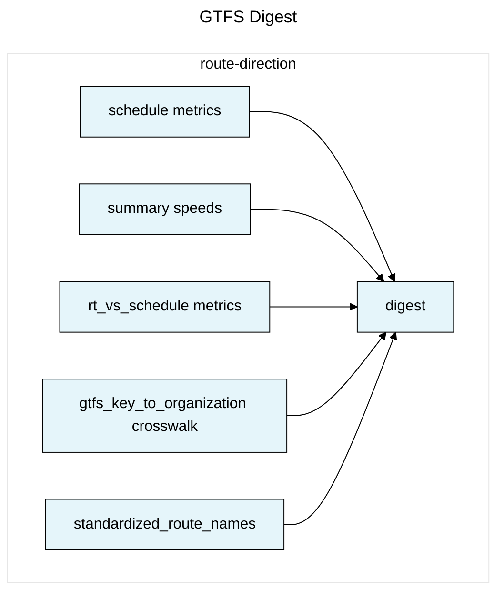

```mermaid
---
title: GTFS Digest
---
%%{
  init: {
    'theme': 'base',
    'themeVariables': {
      'primaryColor': '#E5F5FA',
      'primaryTextColor': '#000',
      'primaryBorderColor': '#000',
      'lineColor': '#000',
      'secondaryColor': '#EFF7EB',
      'tertiaryColor': '#fff'
    }
  }
}%%

flowchart TB
    subgraph route-direction
    
    classDef df fill:#E5F5FA
    classDef script fill:#EFF7EB
    
        A[schedule metrics]:::df --> digest;
        B[summary speeds]:::df --> digest; 
        C[rt_vs_schedule metrics]:::df --> digest;
        D[gtfs_key_to_organization crosswalk]:::df --> digest;
        E[standardized_route_names]:::df --> digest;
        
    end
        
```