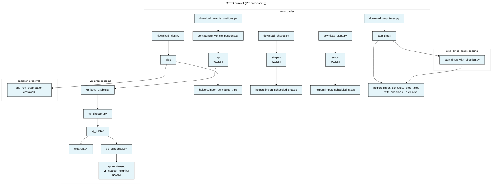

```mermaid
---
title: GTFS Funnel (Preprocessing)
---
%%{
  init: {
    'theme': 'base',
    'themeVariables': {
      'primaryColor': '#E5F5FA',
      'primaryTextColor': '#000',
      'primaryBorderColor': '#000',
      'lineColor': '#000',
      'secondaryColor': '#EFF7EB',
      'tertiaryColor': '#fff'
    }
  }
}%%

graph TB
    
    subgraph downloader
        A1[download_trips.py] --> A[trips] --> 
            helpers.import_scheduled_trips;
        B1[download_shapes.py] --> B[shapes 
        WGS84] --> helpers.import_scheduled_shapes;
        C1[download_stops.py] --> C[stops 
        WGS84] --> helpers.import_scheduled_stops;
        D1[download_stop_times.py] --> D[stop_times] --> 
            D2[helpers.import_scheduled_stop_times
            with_direction = True/False
            ];
        E1[download_vehicle_positions.py] --> E2[concatenate_vehicle_positions.py] 
            --> E[vp 
            WGS84];

    end

    subgraph stop_times_preprocessing
        D --> D3[stop_times_with_direction.py] --> D2;

    end

    subgraph vp_preprocessing
        E --> E3[vp_keep_usable.py] --> E4[vp_direction.py] 
        --> F[vp_usable] --> E5[cleanup.py];
        F --> F1[vp_condenser.py] --> F2[vp_condensed
        vp_nearest_neighbor
        NAD83];
    
    end

    subgraph operator_crosswalk
        A --> G[gtfs_key_organization crosswalk];

    end
```