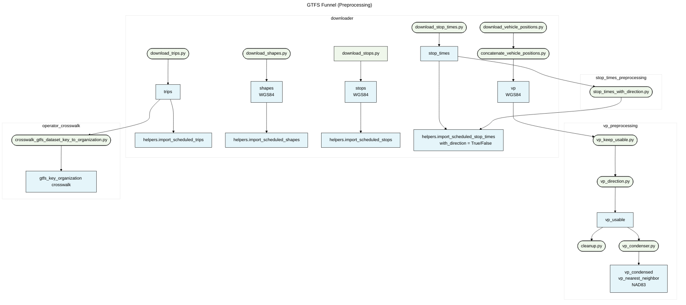
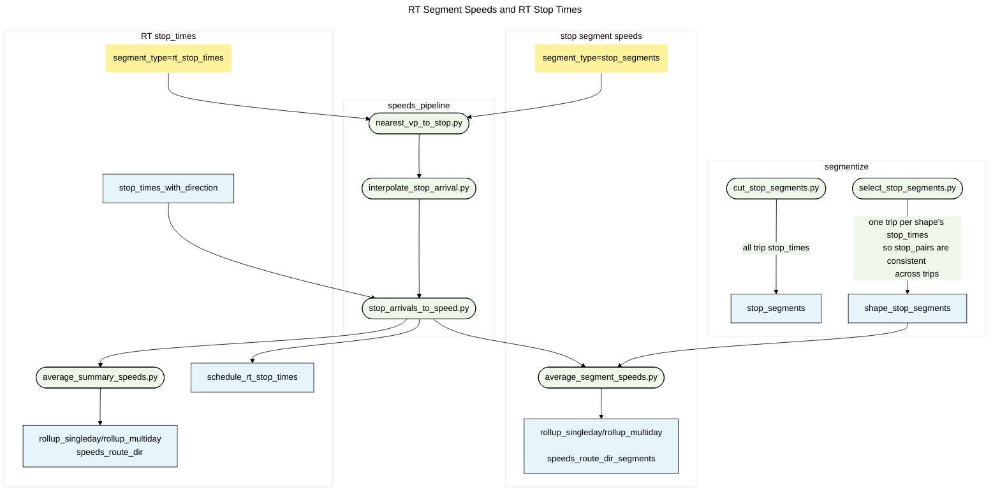
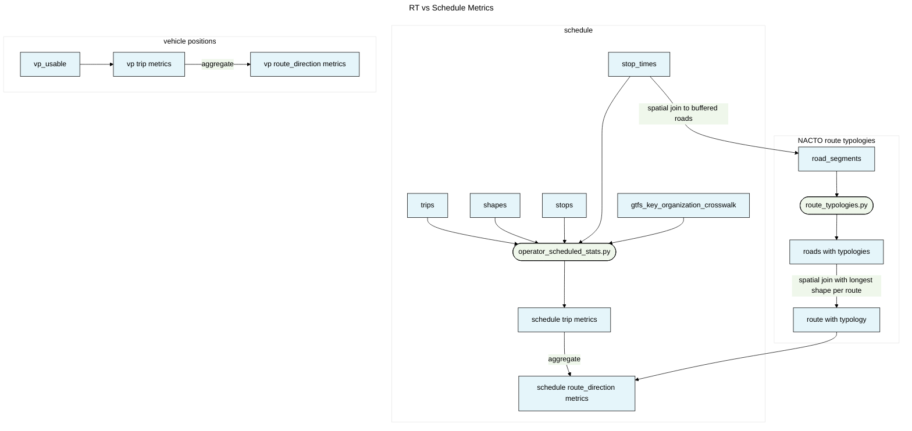
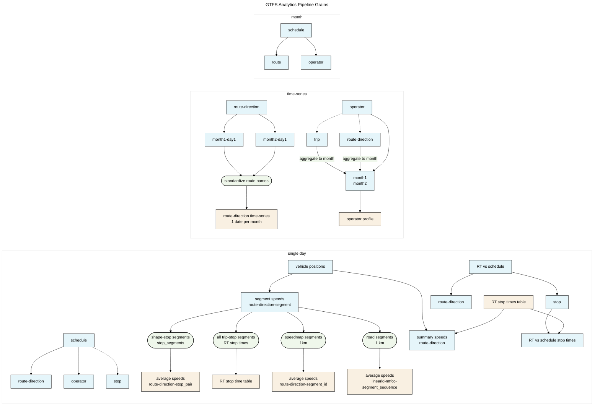

# Mermaid Diagrams for GTFS funnel, segment speeds, RT vs schedule

## GTFS Funnel

```mermaid
---
title: GTFS Funnel (Preprocessing)
---
%%{
  init: {
    'theme': 'base',
    'themeVariables': {
      'primaryColor': '#E5F5FA',
      'primaryTextColor': '#000',
      'primaryBorderColor': '#000',
      'lineColor': '#000',
      'secondaryColor': '#EFF7EB',
      'tertiaryColor': '#fff'
    }
  }
}%%

graph TB
    
    subgraph downloader
        classDef df fill:#E5F5FA
        classDef script fill:#EFF7EB

        A1([download_trips.py]):::script --> 
            A[trips]:::df --> 
            helpers.import_scheduled_trips;
        B1([download_shapes.py]):::script --> 
            B[shapes<br>WGS84]:::df --> 
            helpers.import_scheduled_shapes;
        C1[download_stops.py]:::script --> 
            C[stops<br>WGS84]:::df --> 
            helpers.import_scheduled_stops;
        D1([download_stop_times.py]):::script --> 
            D[stop_times]:::df --> 
            D2[helpers.import_scheduled_stop_times
            with_direction = True/False];
        E1([download_vehicle_positions.py]):::script --> 
            E2([concatenate_vehicle_positions.py]):::script 
            --> E[vp<br>WGS84]:::df;

    end

    subgraph stop_times_preprocessing
        D --> 
        D3([stop_times_with_direction.py]):::script --> 
        D2;

    end

    subgraph vp_preprocessing
        E --> E3([vp_keep_usable.py]):::script --> 
            E4([vp_direction.py]):::script --> 
            F[vp_usable]:::df --> 
            E5([cleanup.py]):::script;
        F --> F1([vp_condenser.py]):::script --> 
            F2[vp_condensed<br>vp_nearest_neighbor<br>NAD83]:::df;
    
    end

    subgraph operator_crosswalk
        A --> 
            G1([crosswalk_gtfs_dataset_key_to_organization.py]):::script 
            --> G[gtfs_key_organization crosswalk]:::df;

    end
```

## RT Segment Speeds

```mermaid
---
title: RT Segment Speeds and RT Stop Times
---
%%{
  init: {
    'theme': 'base',
    'themeVariables': {
      'primaryColor': '#E5F5FA',
      'primaryTextColor': '#000',
      'primaryBorderColor': '#000',
      'lineColor': '#000',
      'secondaryColor': '#EFF7EB',
      'tertiaryColor': '#fff'
    }
  }
}%%

flowchart TB
    subgraph segmentize
        classDef df fill:#E5F5FA
        classDef script fill:#EFF7EB
        classDef segmentType fill:#FCF39C, stroke:#fff

        A1([cut_stop_segments.py]):::script -- 
            all trip stop_times --> 
            A[stop_segments]:::df;
        B1([select_stop_segments.py]):::script -- 
        one trip per shape's stop_times
        so stop_pairs are consistent 
        across trips -->
        B[shape_stop_segments];

        
    end

    subgraph speeds_pipeline

        C([nearest_vp_to_stop.py]):::script --> 
            D([interpolate_stop_arrival.py]):::script --> 
            E([stop_arrivals_to_speed.py]):::script; 

    end

    subgraph stop segment speeds
        F(segment_type=stop_segments):::segmentType --> 
            C;
        E --> G([average_segment_speeds.py]):::script -->
        H[rollup_singleday/rollup_multiday
        speeds_route_dir_segments]:::df;
        B --> G; 

    end

    subgraph RT stop_times
        J(segment_type=rt_stop_times):::segmentType --> 
            C;
        E --> K([average_summary_speeds.py]):::script -->
        L[rollup_singleday/rollup_multiday
        speeds_route_dir];
        M[stop_times_with_direction] --> E --> 
        N[schedule_rt_stop_times];

    end
```

## RT vs Schedule Metrics

```mermaid
---
title: RT vs Schedule Metrics
---
%%{
  init: {
    'theme': 'base',
    'themeVariables': {
      'primaryColor': '#E5F5FA',
      'primaryTextColor': '#000',
      'primaryBorderColor': '#000',
      'lineColor': '#000',
      'secondaryColor': '#EFF7EB',
      'tertiaryColor': '#fff'
    }
  }
}%%

flowchart TB
    subgraph schedule
        classDef df fill:#E5F5FA
        classDef script fill:#EFF7EB

        A[trips]:::df --> 
            E([operator_scheduled_stats.py]):::script;
        B[shapes]:::df --> E;
        C[stops]:::df --> E;
        D[stop_times]:::df --> E;
        F[gtfs_key_organization_crosswalk]:::df --> E; 
        E --> L[schedule trip metrics]:::df -- aggregate --> 
            M[schedule route_direction metrics]:::df;

    end

    subgraph NACTO route typologies
        D -- spatial join to buffered roads --> 
            G[road_segments]:::df --> 
            H([route_typologies.py]):::script -->
            J[roads with typologies]:::df -- 
            spatial join with longest shape per route -->
            K[route with typology]:::df -->M;  

    end

    subgraph vehicle positions

        N[vp_usable]:::df --> 
            O[vp trip metrics]:::df -- aggregate 
            --> P[vp route_direction metrics]:::df;
        
    end
```

## Grains

```mermaid
---
title: GTFS Analytics Pipeline Grains
---
%%{
  init: {
    'theme': 'base',
    'themeVariables': {
      'primaryColor': '#E5F5FA',
      'primaryTextColor': '#000',
      'primaryBorderColor': '#000',
      'lineColor': '#000',
      'secondaryColor': '#EFF7EB',
      'tertiaryColor': '#fff'
    }
  }
}%%

flowchart LR
    classDef rect fill:#E5F5FA
    classDef circle fill:#EFF7EB
    classDef rect2 fill:#F9F0E2

    subgraph single day
    
        A[schedule] --> A1[route-direction]
        A --> A2[operator]
        A -.-> A3[stop]

        B[vehicle positions] --> B1[segment speeds
        route-direction-segment]

        B1 --> B1a([shape-stop segments
        stop_segments]):::circle 
        B1a --> C1a[average speeds
        route-direction-stop_pair]:::rect2
        
        B1 --> B1b([all trip-stop segments
        RT stop times]):::circle
        B1b --> C1b[RT stop time table]:::rect2
        
        B1 --> B1c([speedmap segments 
        1km]):::circle
        B1c --> C1c[average speeds 
        route-direction-segment_id]:::rect2

        B1 --> B1d([road segments
        1 km]):::circle
        B1d --> C1d[average speeds
        linearid-mtfcc-segment_sequence]:::rect2
        
        B --> B3[summary speeds 
        route-direction] 
        B2[RT stop times table]:::rect2 --> B3

        D[RT vs schedule] --> D1[route-direction]
        D --> D2[stop] --> D3[RT vs schedule stop times]
        B2 --> D3

    end

    subgraph time-series

        F[route-direction]

        F --> F1[month1-day1] --> R([standardize route names]):::circle
        F --> F2[month2-day1] --> R

        R --> F3[route-direction time-series
        1 date per month]:::rect2

        G[operator]
        G -.-> G1[trip] -- aggregate to month --> G3
        G -.-> G2[route-direction] -- aggregate to month --> G3
        G --> G3[month1 
        month2] --> H[operator profile]:::rect2

    end

    subgraph month

        X[schedule] --> X1[route]
        X --> X2[operator]

    end
  
```