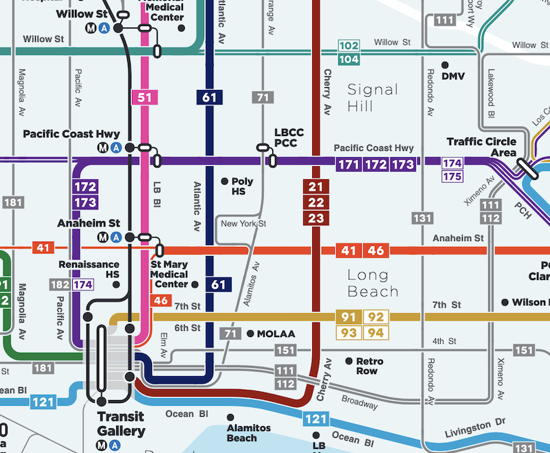

# High Quality Transit Areas Analysis

## Open Data Portal 

These datasets are updated **monthly**. We usually use a Wednesday in the middle of the month. The datasets reflect the a snapshot in time based on published GTFS schedule data.

1. [HQTA Areas](https://gis.data.ca.gov/datasets/863e61eacbf3463ab239beb3cee4a2c3_0) -- start here for any policy or planning analysis related to high quality transit.
1. [HQTA Stops](https://gis.data.ca.gov/datasets/f6c30480f0e84be699383192c099a6a4_0) -- use this to understand the transit stops that go into defining high quality transit areas.
1. [CA Transit Routes](https://gis.data.ca.gov/datasets/dd7cb74665a14859a59b8c31d3bc5a3e_0)
1. [CA Transit Stops](https://gis.data.ca.gov/datasets/900992cc94ab49dbbb906d8f147c2a72_0)

## Understanding the Open Data

### Frequency Standards have Diverged

Assembly Bill 2553(2024) is changing the definition of a bus major transit stop to be the intersection of two corridors with a service interval (headway) of every 20 minutes (3 trips/hr), instead of every 15 minutes (4 trips/hr). Although the bill formally takes effect January 1, 2025, our dataset now incorporates this change.

This means that there are now two frequency standards captured by this dataset:

* 4 trips/hr (15min headway) for high quality transit corridors, as well as bus rapid transit major stops (along with other requirements for BRT)
* 3 trips/hr (20min headway) for bus corridors intersecting to form a bus major stop

With this change, bus major stops are no longer a subset of high quality transit corridors, since the intersection of two corridors with frequencies of 3 trips/hr now creates a major stop despite neither being a high quality transit corridor.

For more details, see [links](#High-Quality-Transit-Areas-Relevant-Statutes) to each statute below.

### How We Count Frequencies

* The AM peak period is defined as 6:00 AM - 8:59 AM. The PM peak period is defined as 3:00 PM - 6:59 PM.
    * Average hourly frequencies are calculated for each stop per peak period.
* Corridors are cut for each operator-route-direction every 1,250 meters.
   * Stops have a 50 meter buffer drawn around them and are spatially joined to corridors.
   * For each 1,250 meter corridor segment, the highest frequency stop is counted (if there are multiple stops).
* We count trips at the highest frequency stop in each corridor segment. Where routes providing similar service share a stop, we combine their trips for frequency calculation. However, we don't combine trips across routes where those routes do not provide similar service. We currently do this by counting the number of stops that different routes share in a given direction.
    * For example, suppose that Route A and Route B share many stops in the same direction. They may be two routes coming together to provide combined service on a corridor while branching elsewhere, or a local and rapid route on the same corridor.
    * In that case if Route A serves the stop twice an hour, and Route B twice an hour, we consider the stop frequency to be 4 trips/hour, qualifying it as a high quality transit corridor and potentially a major bus stop (if an intersecting corridor is present)
    * If, however, Route A and Route B only shared one or two stops, for example starting together at a transit center but going off in different directions, we would not combine them for stop frequency calculations.
    * See [technical_notes.md](technical_notes.md) for additional details.
    
### Why Not one "Route" at a Time?

There is not a consistent practice as to what constitutes one "route" in the transit industry. A single "route" can have some trips that deviate from the usual routing without changing the route name or number, or have some trips only serve part of the route (shortlining). Multiple "routes" can combine to serve the same corridor and stops for many miles. The latter practice, often called interlining, is especially common, as is having local and rapid routes that take the same path but with different stop spacing.

In the above example, Atlantic Ave is served by only Route 61, while Pacific Coast Highway is served by Routes 171, 172, and 173. Those routes combine to equal a higher frequency for riders travelling along PCH than along Atlantic, yet if we only considered one "route" at a time we would categorize Atlantic as a high quality corridor and not PCH (nor Anaheim and 7th, which function the same). We believe this would inaccurately reflect the transit rider experience.

By considering each corridor segment seperately, our methodology is sensitive to where "routes" combine to offer high frequencies, as well as to where they diverge (or where a single route shortlines) and no longer meet the relevant frequency standard.

### HQTA Areas is the Primary Dataset

Per statute, High Quality Transit Areas are defined as the _half-mile surrounding_ high quality transit corridors and major transit stops. Our HQTA Areas (polygon) dataset already incorporates this half-mile buffer.

Using the HQTA Areas dataset, it's possible to determine if an area qualifies because it is a high quality transit corridor, major transit stop, or both. This is useful for certain kinds of analyses, since some statutes and programs only reference major transit stops and don't include high quality transit corridors.

We provide the HQTA Stops dataset as a convienience for certain kinds of analysis where it would be helpful to know actual stop locations. Note that the `hq_corridor_bus` type includes all stops in a high quality corridor. Since we make the high quality corridor determination at the corridor segment level and only then find the stops within that corridor, not every `hq_corridor_stop` is guaranteed to have frequent service (though they could all have frequent service, and at least one stop every 1,250 meters will have frequent service).

### Additional Details

* `hqta_type = hq_corridor_bus`
    * `hqta_details` is `corridor_frequent_stop` if the stop has at least 4 peak trips, `corridor_other_stop` otherwise.
* `hqta_type = major_stop_bus`
    * Major stop bus is designation of stops appearing within 500 feet of the intersection of 2 "major stop precursor corridors" with frequencies of at least 3 trips/hr. In our analysis, corridors have an operator and route associated to track it. All stops within 500 feet of the intersection are collectively considered the "major transit stop", and the half-mile major transit stop buffer extends from each stop and is dissolved into a single polygon.
    * If the intersection was between 2 different operators (different agency names), `hqta_details = intersection_2_bus_routes_different_operators`.
    * If the intersection was between routes of the same operator, `hqta_details = intersection_2_bus_routes_same_operator`
* A half-mile buffered dataset is provided for high quality transit areas. We recommend using the polygon dataset. To get the stops (points) that create these half mile polygons, we do also provide high quality transit stops.
*  `peak_trips`: This column should be interpreted as: *at least x trips per hour in the peak period*. 
    * If AM and PM values differ, the *lesser* value is reported. 
    * Ex: 5 AM peak trips, 4 PM peak trips would show a value of `peak_trips = 4`.

## High Quality Transit Areas Relevant Statutes

[PRC 21155](https://leginfo.legislature.ca.gov/faces/codes_displaySection.xhtml?sectionNum=21155.&lawCode=PRC)
* Major transit stop definition: _A major transit stop is as defined in Section 21064.3, except that, for purposes of this section, it also includes major transit stops that are included in the applicable regional transportation plan_
* High-quality transit corridor definition: _For purposes of this section, a high-quality transit corridor means a corridor with fixed route bus service with service intervals no longer than 15 minutes during peak commute hours._
    * Statute does not define "peak commute hours", however we've started using fixed peak periods to align our methodology with other stateholders.

[PRC 21064.3](https://leginfo.legislature.ca.gov/faces/codes_displaySection.xhtml?sectionNum=21064.3.&lawCode=PRC)
* _Major transit stop means a site containing any of the following:
(a) An existing rail or bus rapid transit station.
(b) A ferry terminal served by either a bus or rail transit service.
(c) The intersection of two or more major bus routes with a frequency of service interval of ~15~ 20 minutes or less during the morning and afternoon peak commute periods._
    * "Intersection" may not be sufficiently well-defined for this analysis

[PRC 21060.2](https://leginfo.legislature.ca.gov/faces/codes_displaySection.xhtml?lawCode=PRC&sectionNum=21060.2.&highlight=true&keyword=bus%20rapid%20transit)
* _(a) “Bus rapid transit” means a public mass transit service provided by a public agency or by a public-private partnership that includes all of the following features:
(1) Full-time dedicated bus lanes or operation in a separate right-of-way dedicated for public transportation with a frequency of service interval of 15 minutes or less during the morning and afternoon peak commute periods.
(2) Transit signal priority.
(3) All-door boarding.
(4) Fare collection system that promotes efficiency.
(5) Defined stations._
    * Unlikely to determine if a service qualifies as BRT under this definition using GTFS alone
    
## Workflow

HQTA data is updated at a monthly frequency for the open data portal. Check the [Makefile](./Makefile) for the most up-to-date order to run the scripts. Run the `Makefile` commands from within the `high_quality_transit_areas` directory.

### Document Monthly Variable

1. Pick a Wednesday in the of the month and put this in [rt_dates](../_shared_utils/shared_utils/rt_dates.py). Update the `DATES` and `METADATA_EDITION` variables.
1. Update this month's `analysis_date` in [update_vars](./update_vars.py)

### HQTA Analysis

Prior to running the HQTA workflow, make sure this month's tables are already downloaded. Check `rt_dates` and the GCS bucket to see if `trips`, `stops`, `shapes`, and `stop_times` are already downloaded. 

If not, within the `gtfs_funnel` directory, run `make download_gtfs_data` in the terminal.

In terminal: `make hqta_data` to run through entire workflow.

1. [Compile rail, ferry, brt data](./rail_ferry_brt_stops.py)
1. [Draw bus corridors, from routes to HQTA segments](./create_hqta_segments.py)
    * Across all operators, find the longest shapes in each direction. Use a symmetric difference to grab the components that make up the route network.
    * Cut route into HQTA segments. Every segment is 1,250 m. 
    * Add in route direction.
1. [Combine operator HQTA areas across operators](./sjoin_stops_to_segments.py)
    * Attach number of stop arrivals that occur in the AM and PM and find the max
    * Do spatial join of stops to HQTA segments. Where multiple stops are present, keep the stop with the highest number of trips.
1. [Use pairwise table to store which segments intersect](./prep_pairwise_intersections.py) 
    * Find which routes actually do intersect, and store that in a pairwise table.
1. [Find where corridors intersect](./get_intersections.py)
1. [Create datasets for each of the hqta types](./create_bus_hqta_types.py)
    * `major_stop_bus`: the bus stop within the above intersection does not necessarily have the highest trip count
    * `hq_corridor_bus`: stops along the HQ transit corr (may not be highest trip count)
1. [Compile and export HQTA areas as points](./assemble_hqta_points.py)
    * Sanity check: [check 3: hqta points](./check_hqta_points.ipynb)
1. [Compile and export HQTA areas as polygons](./assemble_hqta_polygons.py)
