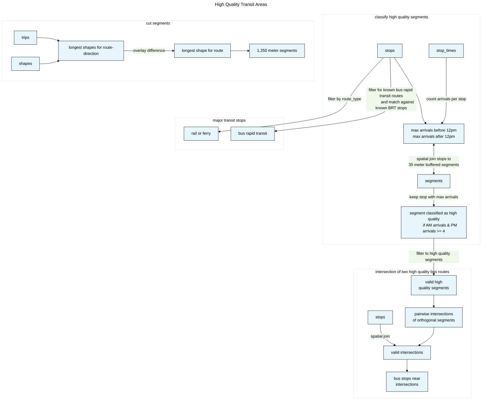

```mermaid
---
title: High Quality Transit Areas
---
%%{
  init: {
    'theme': 'base',
    'themeVariables': {
      'primaryColor': '#E5F5FA',
      'primaryTextColor': '#000',
      'primaryBorderColor': '#000',
      'lineColor': '#000',
      'secondaryColor': '#EFF7EB',
      'tertiaryColor': '#fff'
    }
  }
}%%

graph TB
    
    subgraph classify high quality segments 
        A[stop_times] -- count arrivals per stop --> B[
            max arrivals before 12pm
            max arrivals after 12pm];
        C[stops] --> B;     
        B <-- spatial join stops to 
        35 meter buffered segments --> D[segments];
        D[segments] -- keep stop with max arrivals -->
            E[segment classified as high quality
            if AM arrivals & PM arrivals >= 4]
    end

    subgraph cut segments
        F[trips] --> H;
        G[shapes] --> H[longest shapes for route-direction] 
            -- overlay difference --> J[longest shape for route] -->
        K[1,250 meter segments];
 
    end

    subgraph major transit stops
        C -- filter by route_type --> L[rail or ferry];
        C -- filter for known bus rapid transit routes
            and match against known BRT stops
            --> M[bus rapid transit];
    
    end

    subgraph intersection of two high quality bus routes
    E -- filter to high quality segments --> N[
        valid high 
        quality segments] --> 
        P[pairwise intersections 
        of orthogonal segments] --> Q[valid intersections];
    R[stops] -- spatial join --> Q --> S[bus stops near 
        intersections];

    end
```