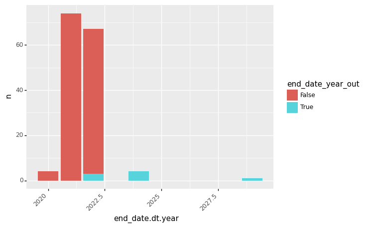
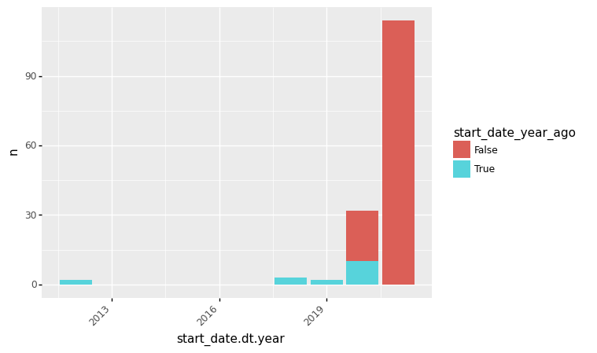
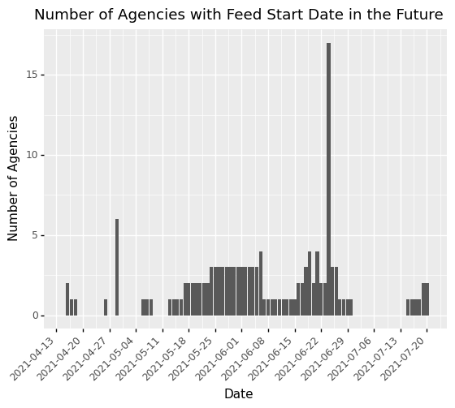
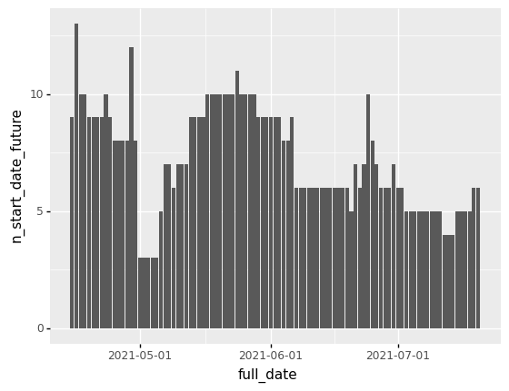
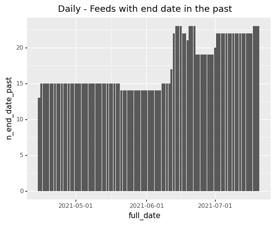
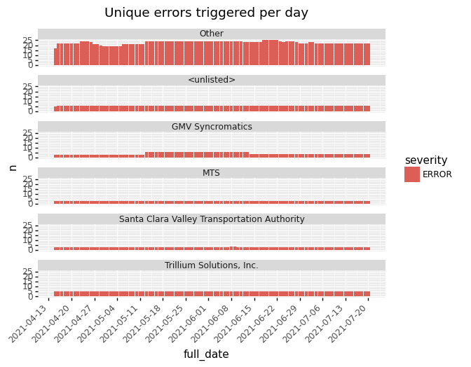
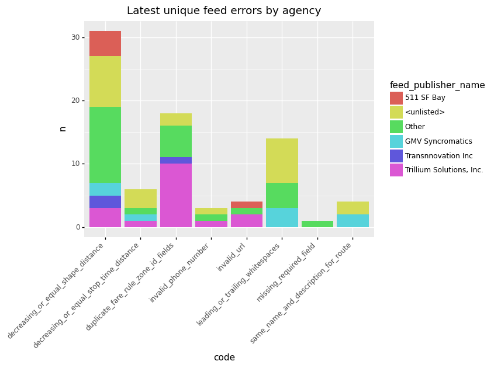
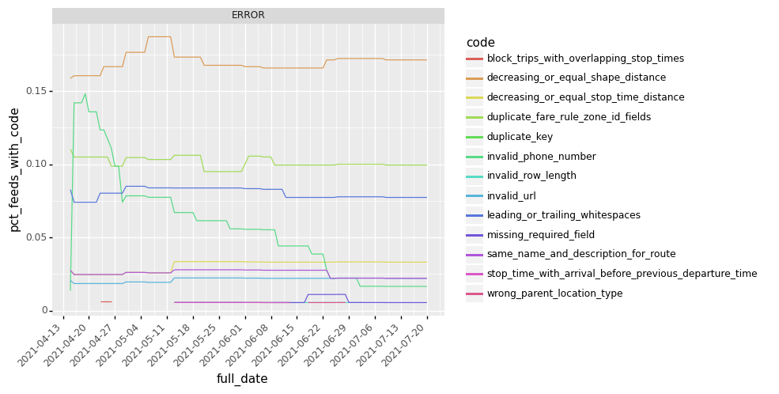

<details>

<summary>show code</summary>


```python
from calitp.tables import tbl
from siuba import *
from siuba.sql import sql_raw
from siuba.experimental import completer
from plotnine import *
```


</details>

<details>

<summary>show code</summary>


```python
from siuba.dply.verbs import singledispatch2
from siuba.sql import LazyTbl

DATE_START = "2021-01-01"
DATE_END = "2021-07-20"


@singledispatch2(LazyTbl)
def cross_by_date(__data, expr_date_filter):
    tbl_dates = tbl.views.dim_date() >> filter(expr_date_filter) >> select(_.full_date)
    return inner_join(
        __data >> mutate(calitp_deleted_at=_.calitp_deleted_at.fillna("2099-01-01")),
        tbl_dates,
        sql_on=lambda lhs, rhs: (lhs.calitp_extracted_at <= rhs.full_date)
        & (lhs.calitp_deleted_at > rhs.full_date),
    )


scale_date_weekly = scale_x_date(date_breaks="1 weeks")
scale_date_monthly = scale_x_date(date_breaks="1 months")

enrich_name = inner_join(
    _, tbl.views.gtfs_agency_names(), ["calitp_itp_id", "calitp_url_number"]
) >> select(_.agency_name, _.calitp_itp_id, _.calitp_url_number, _.contains(""))
```


</details>

## Are Feed Expiration dates meaningful and reliable?

<details>

<summary>show code</summary>


```python
DATE_YEAR_AGO = "2020-07-14"
DATE_YEAR_OUT = "2022-07-12"
TODAY_DATE = "2020-07-15"
DATE_MONTH_AGO = "2020-06-15"

# TODO: should not hard code DATE_YEAR_AGO, since depends on date today
tbl_feed_info = (tbl.gtfs_schedule.feed_info()                   
     >> mutate(
         start_date = sql_raw('PARSE_DATE("%Y%m%d", feed_start_date)'),
         end_date = sql_raw('PARSE_DATE("%Y%m%d", feed_end_date)'),
         start_date_year_ago = _.start_date < DATE_YEAR_AGO,
         end_date_year_out = _.end_date > DATE_YEAR_OUT,
         date_diff_days=sql_raw("DATE_DIFF(end_date, start_date, DAY)"),
         date_diff_btn_year = _.date_diff_days < 365,
         
         start_date_btn_month = (_.start_date > DATE_MONTH_AGO) & (_.start_date < TODAY_DATE),
         end_date_btn_month = (_.end_date > DATE_MONTH_AGO) & (_.end_date < TODAY_DATE)
     )
    >> enrich_name
)
```


</details>

<details>

<summary>show code</summary>


```python
tbl_expiration = (
    tbl_feed_info
    >> mutate(end_date_max=_.end_date.max(), start_date_min=_.start_date)
    >> summarize(
        start_date_min=_.start_date_min.min(),
        end_date_max=_.end_date_max.max(),
        n_start_date_min=(_.start_date == _.start_date_min).astype(int).sum(),
        n_end_date_max = (_.end_date == _.end_date_max).astype(int).sum(),
        #n_start_date_min=(_.end_date == _.end_date_max).astype(int).sum(),
        n_start_date_year=(_.start_date < DATE_YEAR_AGO).astype(int).sum(),
        n_end_date_year=(_.end_date > DATE_YEAR_OUT).astype(int).sum(),
        avg_date_diff=_.date_diff_days.mean().round(),
        n_date_diff_btn_year = _.date_diff_btn_year.astype(int).sum(),
        
        n_start_date_btn_month = _.start_date_btn_month.astype(int).sum(),
        n_end_date_btn_month = _.end_date_btn_month.astype(int).sum(),
    
    )
 
)
```


</details>

<details>

<summary>show code</summary>


```python
tbl_expiration >> collect() >> pipe(_.melt())
```


</details>


<div>
<style scoped>
    .dataframe tbody tr th:only-of-type {
        vertical-align: middle;
    }

    .dataframe tbody tr th {
        vertical-align: top;
    }

    .dataframe thead th {
        text-align: right;
    }
</style>
<table border="1" class="dataframe">
  <thead>
    <tr style="text-align: right;">
      <th></th>
      <th>variable</th>
      <th>value</th>
    </tr>
  </thead>
  <tbody>
    <tr>
      <th>0</th>
      <td>start_date_min</td>
      <td>2012-02-01</td>
    </tr>
    <tr>
      <th>1</th>
      <td>end_date_max</td>
      <td>2029-12-31</td>
    </tr>
    <tr>
      <th>2</th>
      <td>n_start_date_min</td>
      <td>153</td>
    </tr>
    <tr>
      <th>3</th>
      <td>n_end_date_max</td>
      <td>1</td>
    </tr>
    <tr>
      <th>4</th>
      <td>n_start_date_year</td>
      <td>17</td>
    </tr>
    <tr>
      <th>5</th>
      <td>n_end_date_year</td>
      <td>8</td>
    </tr>
    <tr>
      <th>6</th>
      <td>avg_date_diff</td>
      <td>346</td>
    </tr>
    <tr>
      <th>7</th>
      <td>n_date_diff_btn_year</td>
      <td>109</td>
    </tr>
    <tr>
      <th>8</th>
      <td>n_start_date_btn_month</td>
      <td>4</td>
    </tr>
    <tr>
      <th>9</th>
      <td>n_end_date_btn_month</td>
      <td>0</td>
    </tr>
  </tbody>
</table>
</div>


* **What is the furthest future date in feed_info_end?** `2029-12-31`
* **How many feeds share this furthest feed_into_end date?** `One`

* **What is the oldest feed_start_date?** `2012-02-01`
* **How many feeds share this feed_start date?** `Two`

* **How Many feeds have a feed_info_end_date more than one year into the future?** `8`
* **How many feeds have a feed_start_date that is more than one year in the future?** `19`

* **What is the average length of time between a feed_info_start and feed_info_end?** `327 Days`
* **How many feeds have one year or less between feed_info_start and feed_info_end?** `130`


### Scratchpad

<details>

<summary>show code</summary>


```python
tbl_feed_info
```


</details>


<div><pre># Source: lazy query
# DB Conn: Engine(bigquery://cal-itp-data-infra/?maximum_bytes_billed=5000000000)
# Preview:
</pre><div>
<style scoped>
    .dataframe tbody tr th:only-of-type {
        vertical-align: middle;
    }

    .dataframe tbody tr th {
        vertical-align: top;
    }

    .dataframe thead th {
        text-align: right;
    }
</style>
<table border="1" class="dataframe">
  <thead>
    <tr style="text-align: right;">
      <th></th>
      <th>agency_name</th>
      <th>calitp_itp_id</th>
      <th>calitp_url_number</th>
      <th>feed_publisher_name</th>
      <th>feed_publisher_url</th>
      <th>feed_lang</th>
      <th>default_lang</th>
      <th>feed_start_date</th>
      <th>feed_end_date</th>
      <th>feed_version</th>
      <th>...</th>
      <th>feed_contact_url</th>
      <th>calitp_extracted_at</th>
      <th>start_date</th>
      <th>end_date</th>
      <th>start_date_year_ago</th>
      <th>end_date_year_out</th>
      <th>date_diff_days</th>
      <th>date_diff_btn_year</th>
      <th>start_date_btn_month</th>
      <th>end_date_btn_month</th>
    </tr>
  </thead>
  <tbody>
    <tr>
      <th>0</th>
      <td>MVGO</td>
      <td>217</td>
      <td>0</td>
      <td>Trillium Solutions, Inc.</td>
      <td>http://www.trilliumtransit.com</td>
      <td>en</td>
      <td>None</td>
      <td>20210708</td>
      <td>20220101</td>
      <td>UTC: 08-Jul-2021 19:41</td>
      <td>...</td>
      <td>http://support.trilliumtransit.com</td>
      <td>2021-07-08</td>
      <td>2021-07-08</td>
      <td>2022-01-01</td>
      <td>False</td>
      <td>False</td>
      <td>177.0</td>
      <td>True</td>
      <td>False</td>
      <td>False</td>
    </tr>
    <tr>
      <th>1</th>
      <td>Metro</td>
      <td>182</td>
      <td>0</td>
      <td>Los Angeles County Metropolitan Transportation...</td>
      <td>https://www.metro.net</td>
      <td>en</td>
      <td>None</td>
      <td>None</td>
      <td>None</td>
      <td>None</td>
      <td>...</td>
      <td>http://developer.metro.net</td>
      <td>2021-07-18</td>
      <td>None</td>
      <td>None</td>
      <td>None</td>
      <td>None</td>
      <td>NaN</td>
      <td>None</td>
      <td>None</td>
      <td>None</td>
    </tr>
    <tr>
      <th>2</th>
      <td>Metro</td>
      <td>182</td>
      <td>1</td>
      <td>Los Angeles County Metropolitan Transportation...</td>
      <td>https://www.metro.net</td>
      <td>en</td>
      <td>None</td>
      <td>None</td>
      <td>None</td>
      <td>None</td>
      <td>...</td>
      <td>http://developer.metro.net</td>
      <td>2021-07-17</td>
      <td>None</td>
      <td>None</td>
      <td>None</td>
      <td>None</td>
      <td>NaN</td>
      <td>None</td>
      <td>None</td>
      <td>None</td>
    </tr>
    <tr>
      <th>3</th>
      <td>GTrans</td>
      <td>118</td>
      <td>0</td>
      <td>Trillium Solutions, Inc.</td>
      <td>http://www.trilliumtransit.com</td>
      <td>en</td>
      <td>None</td>
      <td>20210623</td>
      <td>20211017</td>
      <td>UTC: 23-Jun-2021 20:13</td>
      <td>...</td>
      <td>http://support.trilliumtransit.com</td>
      <td>2021-06-23</td>
      <td>2021-06-23</td>
      <td>2021-10-17</td>
      <td>False</td>
      <td>False</td>
      <td>116.0</td>
      <td>True</td>
      <td>False</td>
      <td>False</td>
    </tr>
    <tr>
      <th>4</th>
      <td>WestCAT</td>
      <td>368</td>
      <td>0</td>
      <td>Trillium Solutions, Inc.</td>
      <td>http://www.trilliumtransit.com</td>
      <td>en</td>
      <td>None</td>
      <td>20210617</td>
      <td>20211001</td>
      <td>UTC: 17-Jun-2021 16:16</td>
      <td>...</td>
      <td>http://support.trilliumtransit.com</td>
      <td>2021-06-17</td>
      <td>2021-06-17</td>
      <td>2021-10-01</td>
      <td>False</td>
      <td>False</td>
      <td>106.0</td>
      <td>True</td>
      <td>False</td>
      <td>False</td>
    </tr>
  </tbody>
</table>
<p>5 rows × 21 columns</p>
</div><p># .. may have more rows</p></div>


<details>

<summary>show code</summary>


```python
# plot end date counts using tbl_feed_info 
(
    tbl_feed_info 
    >> collect()
    >> filter(_.end_date.notna())
    >> mutate(end_date = _.end_date.astype("datetime64[ns]"), n = 1)
    >> ggplot(aes("end_date.dt.year", "n", fill="end_date_year_out")) + geom_col() + theme(axis_text_x = element_text(angle=45, hjust=1))
)
#missing years are not plotted
```


</details>


    

    


    <ggplot: (276362207)>


<details>

<summary>show code</summary>


```python
# plot start date counts using tbl_feed_info 
(
    tbl_feed_info 
    >> collect()
    >> filter(_.start_date.notna())
    >> mutate(start_date = _.start_date.astype("datetime64[ns]"), n = 1)
    >> ggplot(aes("start_date.dt.year", "n", fill="start_date_year_ago")) + geom_col() + theme(axis_text_x = element_text(angle=45, hjust=1))
)
#missing years are not plotted
```


</details>


    

    


    <ggplot: (274504439)>


## How many agencies have invalid GTFS Data? 

<details>

<summary>show code</summary>


```python
tbl_feed_info_daily = (
    tbl.gtfs_schedule_type2.feed_info()
    >> mutate(deleted_at=_.calitp_deleted_at.fillna("2099-01-01"))
    >> cross_by_date(_.full_date.between(DATE_START, DATE_END))
    >> mutate(
        start_date=sql_raw('PARSE_DATE("%Y%m%d", feed_start_date)'),
        end_date=sql_raw('PARSE_DATE("%Y%m%d", feed_end_date)'),
        date_start_future=(_.start_date > _.full_date).astype(int),
        date_end_past=(_.end_date < _.full_date).astype(int),
        date_diff_days=sql_raw("DATE_DIFF(end_date, start_date, DAY)"),
        date_diff_short=_.date_diff_days < 365,
    )
    >> enrich_name
)

# has feed info for every feed, for every day in the past month
tbl_feed_info_daily_agg = (
    tbl_feed_info_daily
    >> group_by(_.full_date)
    >> summarize(
        avg_date_diff=_.date_diff_days.mean(),
        n_start_future=_.date_start_future.sum(),
        n_end_past=_.date_end_past.sum(),
        pct_start_future=_.date_start_future.mean(),
        pct_end_past=_.date_end_past.mean(),
    )
    >> collect()
)
```


</details>

<details>

<summary>show code</summary>


```python
tbl_calendar_info = (
    tbl.gtfs_schedule_type2.calendar()
    >> cross_by_date(_.full_date.between(DATE_START, DATE_END))
    >> mutate(
        calendar_start_date=sql_raw('PARSE_DATE("%Y%m%d", start_date)'),
        calendar_end_date=sql_raw('PARSE_DATE("%Y%m%d", end_date)'),
        calendar_start_date_future=_.calendar_start_date > _.full_date,
        calendar_end_date_past=_.calendar_end_date < _.full_date,
    )
)

tbl_calendar_feed_expiration = (
    tbl_calendar_info
    >> mutate(
        calendar_end_date_max=_.calendar_end_date.max(),
        calendar_start_date_min=_.calendar_start_date.min(),
    )
    >> enrich_name
    >> group_by(_.full_date, _.calitp_itp_id, _.calitp_url_number)  # grouping by feed
    >> summarize(
        end_date_max=_.calendar_end_date_max.max(),
        start_date_min=_.calendar_start_date_min.min(),
        pct_start_date_future=(_.calendar_start_date_future).astype(int).mean(),
        pct_end_date_past=(_.calendar_end_date_past).astype(int).mean(),
    )
)

tbl_calendar_expiration = (
    tbl_calendar_feed_expiration
    >> group_by(_.full_date)
    >> summarize(
        n_start_date_future=(_.pct_start_date_future == 1).astype(int).sum(),
        n_end_date_past=(_.pct_end_date_past == 1).astype(int).sum(),
    )
)
```


</details>

### Feed info related

* **For each day in the past month, how many agencies had a feed_end_date in the past?**
* **For each day in the past month, how many agencies had a feed_start_date in the future?** 

<details>

<summary>show code</summary>


```python
(
    tbl_feed_info_daily_agg
    >> ggplot(aes("full_date", "n_start_future"))
    + geom_col()
    + labs(y="Number of Agencies", x="Date")
    + scale_x_datetime(date_breaks="1 weeks")
    + theme(axis_text_x=element_text(angle=45, hjust=1))
    + ggtitle("Number of Agencies with Feed Start Date in the Future")
)
```


</details>


    

    


    <ggplot: (306255604)>


### Calendar related

* **For how many feeds are all end_dates in the past?**
* **For how many feeds are all start_dates in the future?**

<details>

<summary>show code</summary>


```python
(
    tbl_calendar_expiration
    >> collect()
    >> ggplot(aes("full_date", "n_start_date_future")) + geom_col() + scale_date_monthly
)
```


</details>


    

    


    <ggplot: (305920278)>


<details>

<summary>show code</summary>


```python
# TODO: this calculation is likely distorted by old feeds that are no longer used
# e.g. agencies.yml removed the feed.
# we'll keep it in our history, so likely need to filter to keep only current
# feed entries.
(
    tbl_calendar_expiration
    >> collect()
    >> mutate(full_date = _.full_date.astype("datetime64[ns]"))
    >> ggplot(aes("full_date", "n_end_date_past")) + geom_col() + scale_date_monthly
    + labs(title = "Daily - Feeds with end date in the past")
)
```


</details>


    

    


    <ggplot: (306431717)>


## How "good" is California transit data? (TODO: calculate on metabase)


* **How many feeds (as a percentage) have zero validation errors?** `25`
* **What is the average number of unique errors per feed?** ``
* **How many feeds are invalid?**


* **How many routes are supported by GTFS feeds?**
* **How many unique agency ids are supported by GTFS feeds?**

## What errors are common on a vendor's feeds?

* What are all the unique errors ~~for each of~~ **across** a vendor’s clients?
* What percent of all feeds have each of these errors? (How common are they?)

NOTE: vendor here defined using feed_info.feed_publisher_name

<details>

<summary>show code</summary>


```python
_tbl_vendor_history = (
    tbl.gtfs_schedule_type2.feed_info()
    >> cross_by_date(_.full_date.between(DATE_START, DATE_END))
    >> select(_.calitp_itp_id, _.calitp_url_number, _.full_date, _.feed_publisher_name)
)

_tbl_validation_code_history = (
    tbl.gtfs_schedule_type2.validation_notices()
    >> cross_by_date(_.full_date.between(DATE_START, DATE_END))
    >> count(_.calitp_itp_id, _.calitp_url_number, _.full_date, _.code, _.severity)
)

tbl_vendor_code_history = (
    _tbl_validation_code_history
    >> left_join(
        _, _tbl_vendor_history, ["calitp_itp_id", "calitp_url_number", "full_date"],
    )
    >> enrich_name
)


# Drill down tables --------

#

tbl_vendor_code_counts = tbl_vendor_code_history >> count(
    _.feed_publisher_name, _.full_date, _.code, _.severity
)

tbl_vendor_daily_metrics = tbl_vendor_code_counts >> count(
    _.feed_publisher_name, _.full_date, _.severity
)

# What percent of all feeds have each of these errors?

_tbl_daily_feed_count = (
    _tbl_vendor_history >> count(_.full_date) >> rename(ttl_feeds="n")
)

tbl_code_metrics = (
    tbl_vendor_code_history
    >> distinct(_.calitp_itp_id, _.calitp_url_number, _.full_date, _.code, _.severity)
    >> count(_.code, _.severity, _.full_date)
    >> rename(n_feeds_with_code="n")
    >> left_join(_, _tbl_daily_feed_count, "full_date")
    >> mutate(pct_feeds_with_code=_.n_feeds_with_code / _.ttl_feeds)
)
```


</details>

### Unique errors across a vendor's clients

<details>

<summary>show code</summary>


```python
# Count of trillium unique errors triggered per day
from siuba.dply.forcats import fct_lump

(
    tbl_vendor_daily_metrics
    >> filter(_.severity == "ERROR")
    >> collect()
    >> mutate(feed_publisher_name = fct_lump(_.feed_publisher_name.fillna("<unlisted>"), n = 5, w = _.n))    
    >> ggplot(aes("full_date", "n", fill="severity"))
     + geom_col()
    + scale_x_date(date_breaks="1 weeks")
    + theme(axis_text_x=element_text(angle=45, hjust=1))    
    + labs(title="Unique errors triggered per day")
    + facet_wrap("~feed_publisher_name", ncol=1)
)
```


</details>


    

    


    <ggplot: (306069688)>


<details>

<summary>show code</summary>


```python
(
    tbl_vendor_code_counts
    >> filter(_.severity == "ERROR", _.full_date == _.full_date.max())
    >> collect()
    >> mutate(feed_publisher_name = fct_lump(_.feed_publisher_name.fillna("<unlisted>"), n = 5, w = _.n))    
    >> ggplot(aes("code", "n", fill="feed_publisher_name"))
     + geom_col()
    + theme(axis_text_x=element_text(angle=45, hjust=1))    
    + labs(title="Latest unique feed errors by agency")
)
```


</details>


    

    


    <ggplot: (306313578)>


### What percent of all feeds have each of these errors? (How common are they?)

<details>

<summary>show code</summary>


```python
(
    tbl_code_metrics
    >> collect()
    >> filter(_.severity == "ERROR")
    >> ggplot(aes("full_date", "pct_feeds_with_code", color="code", group="code"))
    + geom_line()
    + facet_wrap("~severity", ncol=1)
    + scale_x_date(date_breaks="1 weeks")
    + theme(axis_text_x=element_text(angle=45, hjust=1))    
)
```


</details>


    

    


    <ggplot: (307328485)>


## What errors should Cal-ITP target for resolution?

* In how many feeds does each error (including warning and info) appear?

NOTE: I'm not sure how this question differs from the previous section
