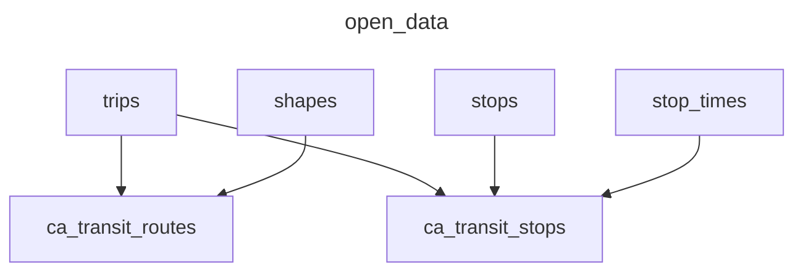

```mermaid
---
title: open_data
---
flowchart TB;
    trips --> ca_transit_routes;
    shapes --> ca_transit_routes
    trips --> ca_transit_stops;
    stops --> ca_transit_stops;
    stop_times --> ca_transit_stops;
```