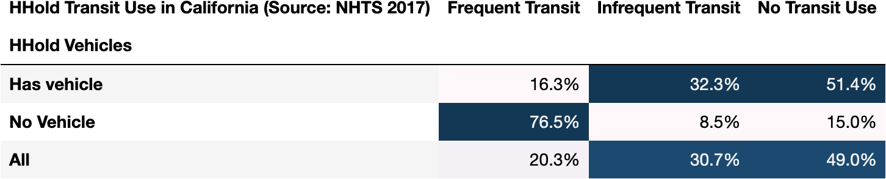
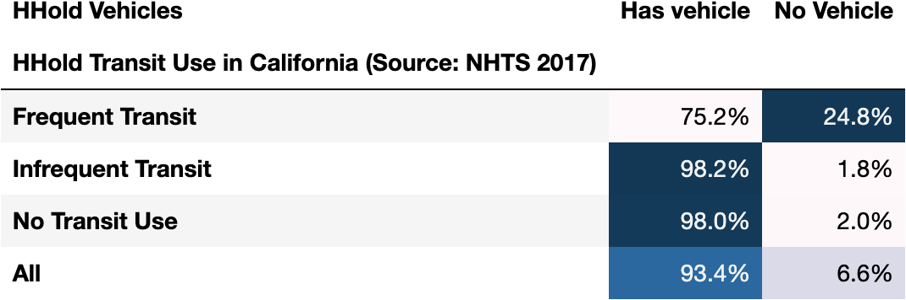
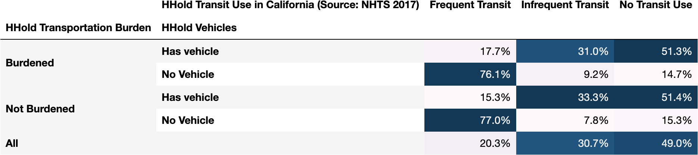

**Which transit-using households have vehicles?**

| HHold Vehicles   |   Frequent Transit |   Infrequent Transit |   No Transit Use |
|:-----------------|-------------------:|---------------------:|-----------------:|
| Has vehicle      |              16.3% |                32.3% |            51.4% |
| No Vehicle       |              76.5% |                 8.5% |            15.0% |
| All              |              20.3% |                30.7% |            49.0% |

**Which vehicle-owning households ride transit?**

| HHold Transit Use in California (Source: NHTS 2017)   |   Has vehicle |   No Vehicle |
|:------------------------------------------------------|--------------:|-------------:|
| Frequent Transit                                      |         75.2% |        24.8% |
| Infrequent Transit                                    |         98.2% |         1.8% |
| No Transit Use                                        |         98.0% |         2.0% |
| All                                                   |         93.4% |         6.6% |

**Does it vary among households who are financially burdened by transportation?**

|                                 |   Frequent Transit |   Infrequent Transit |   No Transit Use |
|:--------------------------------|-------------------:|---------------------:|-----------------:|
| ('Burdened', 'Has vehicle')     |              17.7% |                31.0% |            51.3% |
| ('Burdened', 'No Vehicle')      |              76.1% |                 9.2% |            14.7% |
| ('Not Burdened', 'Has vehicle') |              15.3% |                33.3% |            51.4% |
| ('Not Burdened', 'No Vehicle')  |              77.0% |                 7.8% |            15.3% |
| ('All', '')                     |              20.3% |                30.7% |            49.0% |

